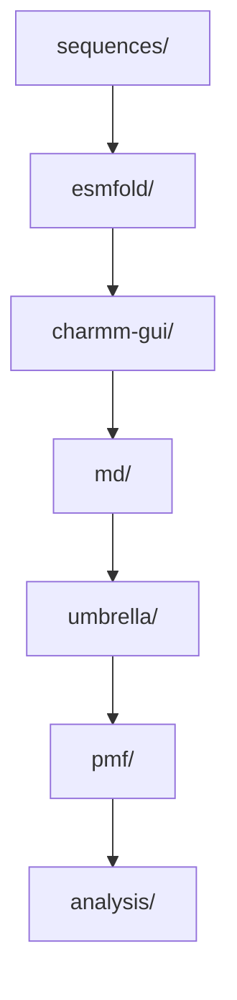

# 01 Computational Discovery

This stage contains the in silico LiSPER discovery workflow: candidate sequences, structure prediction, CHARMM-GUI system construction, GROMACS simulations, umbrella sampling, PMF analysis, data, and analysis outputs.

## Contents

| Folder | Purpose |
|---|---|
| `sequences/` | Candidate peptide sequences and metadata. |
| `esmfold/` | ESMFold predictions and CHARMM-GUI-ready PDBs. |
| `charmm-gui/` | LiCl and NaCl system-builder outputs. |
| `md/` | GROMACS minimization, equilibration, production, clustering, and remote logs. |
| `umbrella/` | Umbrella sampling setup and future windows. |
| `pmf/` | PMF and Delta G analysis. |
| `analysis/` | Cross-stage computational interpretation and ranking work. |
| `data/` | Raw and processed computational data not tied to one workflow folder. |
