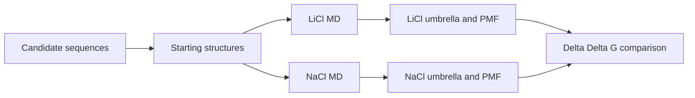

# Computational discovery

The eight-candidate LiSPER campaign has completed structure preparation, paired LiCl/NaCl MD, representative selection, umbrella sampling, and PMF analysis. The [selectivity summary](pmf/selectivity_summary.tsv) contains eight paired estimates. These are computational, within-protocol comparisons; experimental binding and uptake remain untested.

| Folder | Purpose |
| --- | --- |
| [sequences](sequences/) | Candidate sequences and design roles |
| [esmfold](esmfold/) | Starting structures and intake provenance |
| [MD](md/) | Paired production simulations and representative structures |
| [umbrella](umbrella/) | Completed paired umbrella campaigns and archive |
| [PMF](pmf/) | Free-energy estimates, uncertainty, and diagnostics |
| [analysis](analysis/) | Cross-stage interpretation |
| [data](data/) | Curated raw and processed data |

The reported quantity is `ΔΔG = ΔG(Li⁺) − ΔG(Na⁺)`; a negative value indicates nominal Li⁺ preference. The estimates are radially corrected and endpoint-referenced, **not 1 M standard-state binding free energies**. Bootstrap SD and sampling diagnostics must accompany any ranking. Candidate trajectories, umbrella windows, and bootstrap draws are not independent biological replicates. Use the [source-validation workflow](../06_project_operations/scripts/analyze_selectivity.py) before publishing a numerical figure or table.
