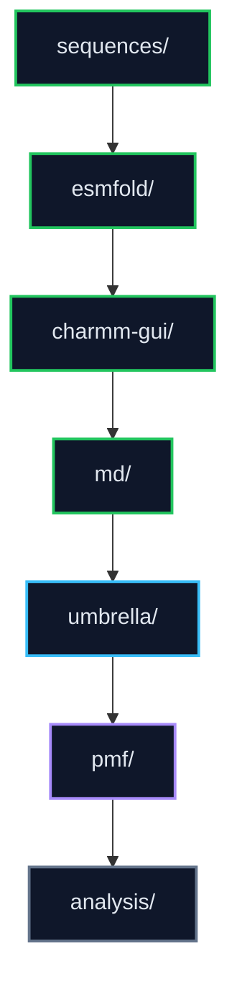

# 01 Computational Discovery

This stage contains the in silico LiSPER discovery workflow: candidate sequences, structure prediction, CHARMM-GUI system construction, GROMACS simulations, umbrella sampling, PMF analysis, data, and analysis outputs.

## Current State

The active computational library is the final **8-candidate** panel in `sequences/candidates.tsv`. ESMFold intake and matched LiCl/NaCl CHARMM-GUI setup are complete for all eight candidates. Current progress reporting focuses on 20 ns production/clustering handoff, refined umbrella sampling, WHAM/PMF QC, and paired Delta Delta G promotion.

Status colors should follow the dashboard palette: complete `#22C55E`, running `#38BDF8`, queued `#FACC15`, QC review `#A78BFA`, warning/repair/failed `#FB7185`/`#EF4444`, and planned `#64748B`. LiCl and NaCl colors are identity accents only: LiCl `#818CF8`, NaCl `#2DD4BF`.

## Contents

| Folder | Purpose |
|---|---|
| `sequences/` | Candidate peptide sequences and metadata. |
| `esmfold/` | ESMFold predictions and CHARMM-GUI-ready PDBs. |
| `charmm-gui/` | LiCl and NaCl system-builder outputs. |
| `md/` | GROMACS minimization, equilibration, 20 ns production, structural clustering, representative extraction, and MD-stage remote logs. |
| `umbrella/` | Umbrella sampling drivers, v2 reaction-coordinate setup, pull stages, window equilibration/production, synced window outputs, and umbrella diagnostics. |
| `pmf/` | WHAM, PMF QC, bootstrap/time-slice checks, Delta G estimates, and paired Delta Delta G analysis. |
| `analysis/` | Cross-stage computational interpretation and ranking work. |
| `data/` | Raw and processed computational data not tied to one workflow folder. |
