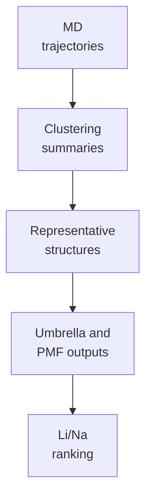

# Analysis

Working area for notebooks, exploratory calculations, intermediate tables, and result interpretation.

## Analysis Flow

## Expected Contents

| Type | Example |
|---|---|
| Notebooks | trajectory inspection, PMF convergence, ranking plots |
| Intermediate tables | cluster populations, RMSD/RMSF, contact summaries |
| Exploratory scripts | one-off analysis before promotion to `../../06_project_operations/scripts/` |

Promote repeatable analysis code to `../../06_project_operations/scripts/` once the workflow stabilizes.
