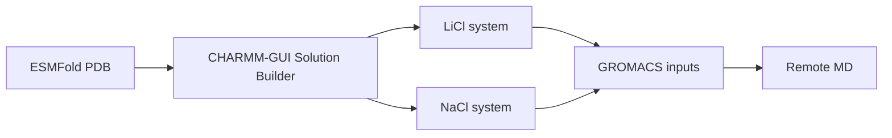

# CHARMM-GUI Systems

This folder stores CHARMM-GUI Solution Builder outputs for the paired LiSPER ion systems.

## Organized Conditions

| Condition | Folder | QC Status | MD Status |
|---|---|---|---|
| LiCl | `li_cl/` | 10/10 ready | Minimization and equilibration complete |
| NaCl | `na_cl/` | 10/10 ready | Minimization and equilibration complete |

## Shared Setup

| Setting | Value |
|---|---|
| Force field | CHARMM36m |
| Water model | TIP3P |
| Box setup | Cubic, 20 A padding |
| Li+ residue name | `LIT` |
| Na+ residue name | `SOD` |
| Cl- residue name | `CLA` |

## Folder Pattern

| Path | Contents |
|---|---|
| `<condition>/raw_archives/` | Original CHARMM-GUI `.tgz` downloads, renamed by candidate |
| `<condition>/systems/` | Extracted CHARMM-GUI output, one folder per candidate |
| `<condition>/metadata/` | Archive mapping, upload order, and QC manifest |
| `<condition>/systems/replaced/` | Preserved superseded setup folders |

Mixed Li+/Na+ competition systems are intentionally excluded from the first-round PMF workflow. The first comparison uses separate LiCl and NaCl systems.
