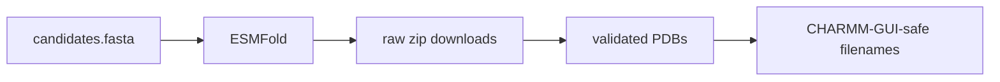

# ESMFold

This folder stores structure-prediction outputs used as starting conformations for CHARMM-GUI.

## Layout

| Path | Contents |
|---|---|
| `raw_zips/` | Original downloaded ESMFold zip files |
| `runs/` | Canonical extracted run folder for each candidate |
| `pdb/` | Flat PDB collection by candidate |
| `charmm_gui_pdb/` | Upload-safe lowercase alphanumeric PDB names |
| `pae/` | Predicted aligned error matrices |
| `plots/` | ESMFold confidence plots |
| `manifest.tsv` | Sequence/file validation manifest |

## CHARMM-GUI Handoff

Upload from `charmm_gui_pdb/`, not from arbitrary downloaded filenames. These files avoid hyphens, spaces, underscores, and mixed capitalization.

| Candidate | Upload File |
|---|---|
| LiD3-1 | `lid31.pdb` |
| LiND-1 | `lind1.pdb` |
| IDP-Li-1 | `idpli1.pdb` |
| IDP-Li-2 | `idpli2.pdb` |
| LowCharge-Li | `lowchargeli.pdb` |
| LiD2-IDP | `lid2idp.pdb` |
| StrongBind-Li | `strongbindli.pdb` |
| SoftCage-Li | `softcageli.pdb` |
| IDP-Rich-Li | `idprichli.pdb` |
| Control-Negative | `controlnegative.pdb` |

## Validation Notes

All 10 ESMFold outputs were decompressed into canonical run folders, and each PDB sequence matched `../sequences/candidates.tsv`.

Low pTM is expected for short flexible peptides and should not be interpreted as a final design score. These structures are starting points; selectivity is evaluated through MD, clustering, umbrella sampling, PMF, and Delta Delta G.
