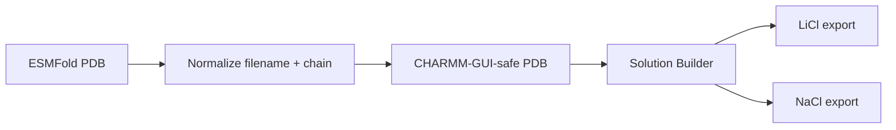

# CHARMM-GUI Upload List

Use the PDB files in `charmm_gui_pdb/` for CHARMM-GUI Solution Builder.

These filenames are lowercase and alphanumeric-only, avoiding hyphens, underscores, spaces, and mixed capitalization.

## Recommended Starting Subset

| Rank | Candidate | PDB |
| --- | --- | --- |
| 1 | LiD3-1 | `charmm_gui_pdb/lid31.pdb` |
| 2 | LiND-1 | `charmm_gui_pdb/lind1.pdb` |
| 3 | IDP-Li-1 | `charmm_gui_pdb/idpli1.pdb` |
| 5 | LowCharge-Li | `charmm_gui_pdb/lowchargeli.pdb` |
| 10 | Control-Negative | `charmm_gui_pdb/controlnegative.pdb` |

## Complete First-Round Library

| Rank | Candidate | PDB |
| --- | --- | --- |
| 1 | LiD3-1 | `charmm_gui_pdb/lid31.pdb` |
| 2 | LiND-1 | `charmm_gui_pdb/lind1.pdb` |
| 3 | IDP-Li-1 | `charmm_gui_pdb/idpli1.pdb` |
| 4 | IDP-Li-2 | `charmm_gui_pdb/idpli2.pdb` |
| 5 | LowCharge-Li | `charmm_gui_pdb/lowchargeli.pdb` |
| 6 | LiD2-IDP | `charmm_gui_pdb/lid2idp.pdb` |
| 7 | StrongBind-Li | `charmm_gui_pdb/strongbindli.pdb` |
| 8 | SoftCage-Li | `charmm_gui_pdb/softcageli.pdb` |
| 9 | IDP-Rich-Li | `charmm_gui_pdb/idprichli.pdb` |
| 10 | Control-Negative | `charmm_gui_pdb/controlnegative.pdb` |

## CHARMM-GUI Setup Reminder

For each candidate, prepare two separate systems:

| System | Cation | Anion | Purpose |
|---|---|---|---|
| peptide + LiCl | Li+ | Cl- | Lithium free-energy branch |
| peptide + NaCl | Na+ | Cl- | Sodium comparison branch |

Use the project defaults from the root README:

| Setting | Value |
|---|---|
| Water model | TIP3P |
| Force field | CHARMM36m |
| Box | Cubic with 20 A padding |
