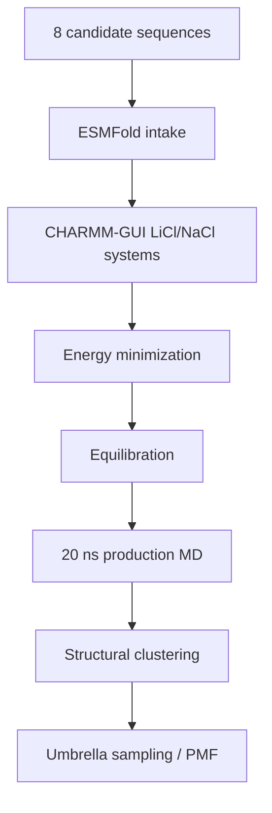

# Molecular Dynamics

This folder tracks GROMACS work for the active 8-candidate LiSPER library after ESMFold and CHARMM-GUI preparation.

## Current State

The active MD workflow now uses the final 8-candidate names. Two candidates already have LiCl production/clustering representatives available; one additional candidate has upstream MD setup/equilibration assets available. Five candidates still need matched CHARMM-GUI systems before MD can proceed.

| Condition | Folder | Current state |
|---|---|---|
| LiCl | `li_cl/` | 2 production/clustering representatives done; 1 setup/equilibration done; 5 pending CHARMM-GUI systems |
| NaCl | `na_cl/` | 3 setup/equilibration records available; 5 pending CHARMM-GUI systems; production/clustering pending |

Remote 8-candidate workspaces were initialized on AutoDL:

| Condition | Remote workspace |
|---|---|
| LiCl | `/root/LiSPER_remote/LiSPER_8cand_LiCl` |
| NaCl | `/root/LiSPER_remote/LiSPER_8cand_NaCl` |

## Workflow

## What Belongs Here

| Sub-area | Purpose |
|---|---|
| `remote_orchestration/` | Scripts and sync maps for the 8-candidate remote workflow |
| `li_cl/remote_runs/` | LiCl launch/status logs for the 8-candidate workflow |
| `li_cl/remote_results/` | Synced LiCl outputs for the 8-candidate workflow |
| `na_cl/remote_runs/` | NaCl launch/status logs for the 8-candidate workflow |
| `na_cl/remote_results/` | Synced NaCl outputs for the 8-candidate workflow |

Do not launch new GROMACS work for a candidate until that candidate has final-name ESMFold and matched CHARMM-GUI inputs ready.
