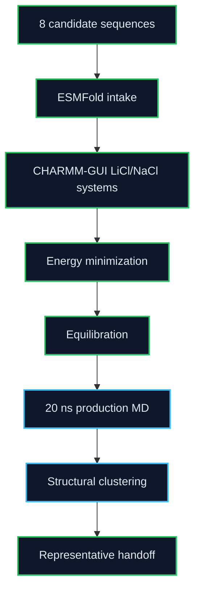

# Molecular Dynamics

This folder tracks the MD-stage GROMACS work for the active 8-candidate LiSPER library after ESMFold and CHARMM-GUI preparation. It owns minimization, equilibration, 20 ns production, structural clustering, and representative extraction. Umbrella sampling and PMF/Delta G artifacts now live in sibling workflow folders.

## Current State

Final 8-candidate MD is in handoff mode: setup is complete, LiCl is complete, NaCl has one active production tail, and free-energy work lives in `../umbrella/` + `../pmf/`.

Latest production/free-energy handoff snapshot: `2026-06-26 13:20 CST`.

Legend: 🟢 complete, 🔵 running, 🟡 queued, 🟣 QC, 🔺 repair/warning, ⚫ planned.

| Condition | Folder | Current state |
|---|---|---|
|  | `li_cl/` | 🟢 `8/8` production, 🟢 `8/8` reps |
|  | `na_cl/` | 🟢 `7/8` reps, 🔵 `1` tail active |
| Free energy | `../umbrella/` + `../pmf/` | 🔵 umbrella, 🟣 PMF QC |

Remote 8-candidate workspaces were initialized on AutoDL:

| Condition | Remote workspace |
|---|---|
| LiCl | `/root/LiSPER_remote/LiSPER_8cand_LiCl` |
| NaCl setup | `/root/LiSPER_remote/LiSPER_8cand_NaCl` |
| NaCl production | `/root/LiSPER_remote/LiSPER_8cand_NaCl_prod_worker` |
| NaCl backfill | `/root/LiSPER_remote/LiSPER_8cand_NaCl_overflow_workerA` |

## Workflow

## What Belongs Here

| Sub-area | Purpose |
|---|---|
| `remote_orchestration/` | Scripts and sync maps for the 8-candidate remote workflow |
| `li_cl/remote_runs/` | LiCl launch/status logs for the 8-candidate workflow |
| `li_cl/remote_results/` | Synced LiCl outputs for the 8-candidate workflow |
| `na_cl/remote_runs/` | NaCl launch/status logs for the 8-candidate workflow |
| `na_cl/remote_results/` | Synced NaCl outputs for the 8-candidate workflow |

Umbrella sampling files are organized in `../umbrella/`. WHAM, PMF QC, Delta G, and Delta Delta G files are organized in `../pmf/`.

Do not launch new GROMACS work for a candidate until that candidate has final-name ESMFold and matched CHARMM-GUI inputs ready.
