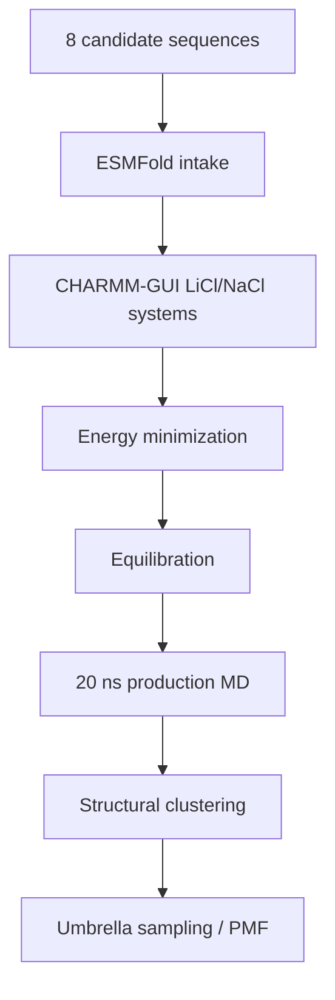

# Molecular Dynamics

This folder tracks GROMACS work for the active 8-candidate LiSPER library after ESMFold and CHARMM-GUI preparation.

## Current State

The active MD workflow now uses the final 8-candidate names. All eight ESMFold structures are ready. All LiCl and NaCl CHARMM-GUI systems are GROMACS-ready. LiCl and NaCl setup are complete for all eight candidates. LiCl and NaCl 20 ns production plus clustering are running across two AutoDL workers without duplicate candidate-condition-stage jobs. Umbrella sampling has started condition-by-condition for clustered representatives: `LiDA-1` LiCl, `LiDS-1` LiCl, and `LiDA-1` NaCl.

Latest production/umbrella snapshot: `2026-06-22 00:07 CST`.

| Condition | Folder | Current state |
|---|---|---|
| LiCl | `li_cl/` | 6/8 production jobs active; `9.99-15.44 ns / 20 ns`; `LiDA-1` and `LiDS-1` produced and clustered; top clusters `17.64%` and `15.69%` |
| NaCl | `na_cl/` | 7/8 production jobs active across both workers; Worker B active jobs `7.50-17.79 ns / 20 ns`; Worker A backfill jobs `2.18-3.24 ns / 20 ns`; `LiDA-1` produced and clustered; top cluster `17.94%` |
| Umbrella | `remote_runs_umbrella_sampling_status.md` | `2/55` valid windows complete; 4 active windows: LiCl `LiDA-1:001`, LiCl `LiDS-1:000`, NaCl `LiDA-1:001-002` |

Remote 8-candidate workspaces were initialized on AutoDL:

| Condition | Remote workspace |
|---|---|
| LiCl | `/root/LiSPER_remote/LiSPER_8cand_LiCl` |
| NaCl setup | `/root/LiSPER_remote/LiSPER_8cand_NaCl` |
| NaCl production | `/root/LiSPER_remote/LiSPER_8cand_NaCl_prod_worker` |
| NaCl backfill | `/root/LiSPER_remote/LiSPER_8cand_NaCl_overflow_workerA` |

## Workflow

## What Belongs Here

| Sub-area | Purpose |
|---|---|
| `remote_orchestration/` | Scripts and sync maps for the 8-candidate remote workflow |
| `li_cl/remote_runs/` | LiCl launch/status logs for the 8-candidate workflow |
| `li_cl/remote_results/` | Synced LiCl outputs for the 8-candidate workflow |
| `na_cl/remote_runs/` | NaCl launch/status logs for the 8-candidate workflow |
| `na_cl/remote_results/` | Synced NaCl outputs for the 8-candidate workflow |

Do not launch new GROMACS work for a candidate until that candidate has final-name ESMFold and matched CHARMM-GUI inputs ready.
