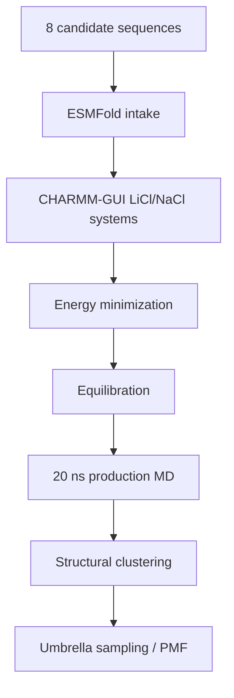

# Molecular Dynamics

This folder tracks GROMACS work for the active 8-candidate LiSPER library after ESMFold and CHARMM-GUI preparation.

## Current State

The old 10-candidate remote GROMACS workflow has been stopped and archived. Active 8-candidate MD has not started yet.

| Condition | Folder | Current state |
|---|---|---|
| LiCl | `li_cl/` | Awaiting revised 8-candidate CHARMM-GUI systems |
| NaCl | `na_cl/` | Awaiting revised 8-candidate CHARMM-GUI systems |

Remote 8-candidate workspaces were initialized on AutoDL:

| Condition | Remote workspace |
|---|---|
| LiCl | `/root/LiSPER_remote/LiSPER_8cand_LiCl` |
| NaCl | `/root/LiSPER_remote/LiSPER_8cand_NaCl` |

Legacy 10-candidate remote workspaces were moved to:

`/root/LiSPER_remote/legacy_10_candidate_runs/`

## Workflow

## What Belongs Here

| Sub-area | Purpose |
|---|---|
| `remote_orchestration/` | Scripts and sync maps for the 8-candidate remote workflow |
| `li_cl/remote_runs/` | LiCl launch/status logs for the 8-candidate workflow |
| `li_cl/remote_results/` | Synced LiCl outputs for the 8-candidate workflow |
| `na_cl/remote_runs/` | NaCl launch/status logs for the 8-candidate workflow |
| `na_cl/remote_results/` | Synced NaCl outputs for the 8-candidate workflow |

Do not restart GROMACS until the active 8-candidate ESMFold and CHARMM-GUI inputs are ready.
