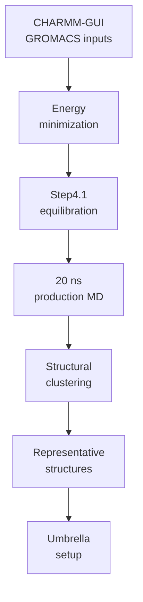

# Molecular Dynamics

This folder tracks GROMACS work after CHARMM-GUI: minimization, equilibration, production MD, structural clustering, and handoff to umbrella sampling.

## Conditions

| Condition | Folder | Current State |
|---|---|---|
| LiCl | `li_cl/` | 10/10 equilibrated; 4 productions complete; `IDP-Li-2` running at 4.46 ns / 20 ns; 4 representatives ready |
| NaCl | `na_cl/` | 10/10 minimized/equilibrated; production/clustering queued behind LiCl |

Latest monitor snapshot: `2026-06-17 18:34 CST`.

## What Belongs Here

| Sub-area | Purpose |
|---|---|
| `remote_orchestration/` | Python and shell scripts copied from the AutoDL machine; records how GROMACS jobs were launched, repaired, queued, and summarized |
| `remote_runs/` | Remote scripts, logs, summaries, and status snapshots |
| `remote_results/` | Synced GROMACS outputs from completed or monitored stages |
| `ready_gromacs_systems.tsv` | Candidate/system index passed from CHARMM-GUI QC |

Keep Li+ and Na+ simulations separate until PMF comparison. This keeps Delta G(Li+) and Delta G(Na+) directly comparable.

Remote upload/download path map: `remote_orchestration/SYNC_PATHS.md`.

Detailed workflow note: `../../06_project_operations/docs/md_to_pmf_workflow.md`.
