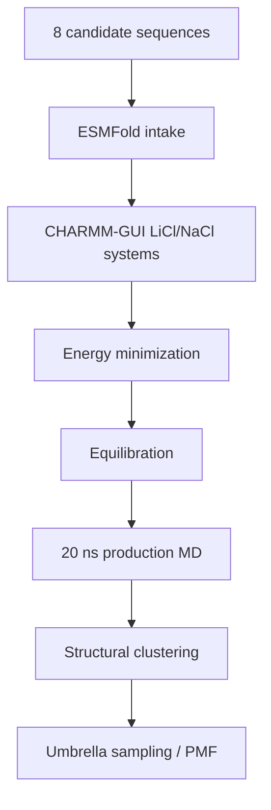

# Molecular Dynamics

This folder tracks GROMACS work for the active 8-candidate LiSPER library after ESMFold and CHARMM-GUI preparation.

## Current State

The active MD workflow now uses the final 8-candidate names. All eight ESMFold structures are ready. All LiCl and NaCl CHARMM-GUI systems are GROMACS-ready. LiCl and NaCl setup are complete for all eight candidates. LiCl and NaCl 20 ns production plus clustering are running across two AutoDL workers without duplicate candidate-condition-stage jobs. Umbrella sampling is active condition-by-condition for clustered representatives.

Latest production/umbrella snapshot: `2026-06-24 10:18 CST`.

| Condition | Folder | Current state |
|---|---|---|
| LiCl | `li_cl/` | Replacement Worker A active at 18/18 safe mdrun threads; 2/8 production jobs active at `15.53-15.61 ns / 20 ns`; 6/8 representatives ready |
| NaCl | `na_cl/` | Worker B has one production job at `14.19 ns / 20 ns`, two NaCl umbrella pulls, two `LiLC-1` windows, and five `LiDA-1` NaCl WHAM/QC repair extensions; Worker A backfill is `5.09-7.78 ns / 20 ns`; 5/8 representatives ready |
| Umbrella | `remote_runs_umbrella_sampling_status.md` | `56` current windows complete; active LiCl windows, active `LiLC-1` NaCl windows, active `LiA3-Ref`/`LiD3-Core` NaCl pulls, and `LiDA-1` NaCl edge-window repair extensions |

Remote 8-candidate workspaces were initialized on AutoDL:

| Condition | Remote workspace |
|---|---|
| LiCl | `/root/LiSPER_remote/LiSPER_8cand_LiCl` |
| NaCl setup | `/root/LiSPER_remote/LiSPER_8cand_NaCl` |
| NaCl production | `/root/LiSPER_remote/LiSPER_8cand_NaCl_prod_worker` |
| NaCl backfill | `/root/LiSPER_remote/LiSPER_8cand_NaCl_overflow_workerA` |

## Workflow

## What Belongs Here

| Sub-area | Purpose |
|---|---|
| `remote_orchestration/` | Scripts and sync maps for the 8-candidate remote workflow |
| `li_cl/remote_runs/` | LiCl launch/status logs for the 8-candidate workflow |
| `li_cl/remote_results/` | Synced LiCl outputs for the 8-candidate workflow |
| `na_cl/remote_runs/` | NaCl launch/status logs for the 8-candidate workflow |
| `na_cl/remote_results/` | Synced NaCl outputs for the 8-candidate workflow |

Do not launch new GROMACS work for a candidate until that candidate has final-name ESMFold and matched CHARMM-GUI inputs ready.
