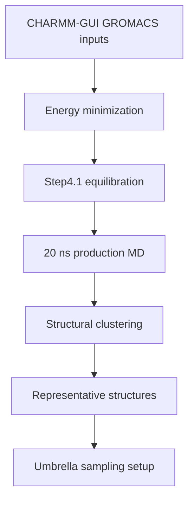

# Molecular Dynamics

This folder tracks GROMACS work after CHARMM-GUI: minimization, equilibration, production MD, structural clustering, and handoff to umbrella sampling.

## Conditions

| Condition | Folder | Current State |
|---|---|---|
| LiCl | `li_cl/` | Equilibrated; 20 ns production/clustering running on remote |
| NaCl | `na_cl/` | Minimized and equilibrated for all 10 systems; production/clustering queued |

## What Belongs Here

| Sub-area | Purpose |
|---|---|
| `remote_orchestration/` | Python and shell scripts copied from the AutoDL machine; records how GROMACS jobs were launched, repaired, queued, and summarized |
| `remote_runs/` | Remote scripts, logs, summaries, and status snapshots |
| `remote_results/` | Synced GROMACS outputs from completed or monitored stages |
| `ready_gromacs_systems.tsv` | Candidate/system index passed from CHARMM-GUI QC |

Keep Li+ and Na+ simulations separate until PMF comparison. This keeps Delta G(Li+) and Delta G(Na+) directly comparable.

Detailed workflow note: `../../06_shared/docs/md_to_pmf_workflow.md`.
