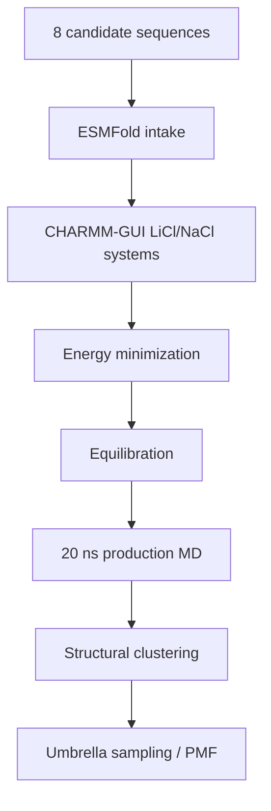

# Molecular Dynamics

This folder tracks GROMACS work for the active 8-candidate LiSPER library after ESMFold and CHARMM-GUI preparation.

## Current State

The active MD workflow now uses the final 8-candidate names. All eight ESMFold structures are ready. All LiCl and NaCl CHARMM-GUI systems are GROMACS-ready. LiCl and NaCl setup are complete for all eight candidates. LiCl 20 ns production plus clustering is running on the original worker, and NaCl 20 ns production plus clustering is running on a second AutoDL worker.

Latest production snapshot: `2026-06-20 02:26 CST`.

| Condition | Folder | Current state |
|---|---|---|
| LiCl | `li_cl/` | 8/8 production jobs active; `4.15-14.28 ns / 20 ns`; clustering queued after each production run |
| NaCl | `na_cl/` | 6 production jobs active + 2 queued after checkpoint-safe optimization; active jobs `2.13-7.56 ns / 20 ns`; queued jobs `0.13-0.16 ns / 20 ns`; clustering queued after each production run |

Remote 8-candidate workspaces were initialized on AutoDL:

| Condition | Remote workspace |
|---|---|
| LiCl | `/root/LiSPER_remote/LiSPER_8cand_LiCl` |
| NaCl setup | `/root/LiSPER_remote/LiSPER_8cand_NaCl` |
| NaCl production | `/root/LiSPER_remote/LiSPER_8cand_NaCl_prod_worker` |

## Workflow

## What Belongs Here

| Sub-area | Purpose |
|---|---|
| `remote_orchestration/` | Scripts and sync maps for the 8-candidate remote workflow |
| `li_cl/remote_runs/` | LiCl launch/status logs for the 8-candidate workflow |
| `li_cl/remote_results/` | Synced LiCl outputs for the 8-candidate workflow |
| `na_cl/remote_runs/` | NaCl launch/status logs for the 8-candidate workflow |
| `na_cl/remote_results/` | Synced NaCl outputs for the 8-candidate workflow |

Do not launch new GROMACS work for a candidate until that candidate has final-name ESMFold and matched CHARMM-GUI inputs ready.
