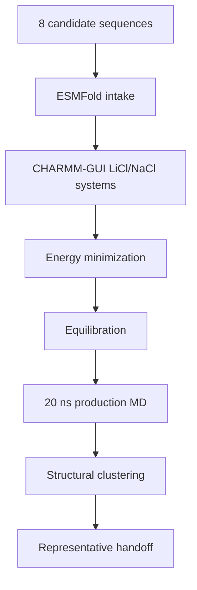

# Molecular Dynamics

This folder tracks the MD-stage GROMACS work for the active 8-candidate LiSPER library after ESMFold and CHARMM-GUI preparation. It owns minimization, equilibration, 20 ns production, structural clustering, and representative extraction. Umbrella sampling and PMF/Delta G artifacts now live in sibling workflow folders.

## Current State

The active MD workflow now uses the final 8-candidate names. All eight ESMFold structures are ready. All LiCl and NaCl CHARMM-GUI systems are GROMACS-ready. LiCl and NaCl setup are complete for all eight candidates. LiCl and NaCl 20 ns production plus clustering are running across two AutoDL workers without duplicate candidate-condition-stage jobs. Clustered representatives are handed to `../umbrella/`; WHAM/PMF/Delta G QC is tracked in `../pmf/`.

Latest production/free-energy handoff snapshot: `2026-06-25 21:20 CST`.

| Condition | Folder | Current state |
|---|---|---|
| LiCl | `li_cl/` | Replacement Worker A has 2/8 production jobs active and 6/8 representatives ready; paired v2 umbrella work has moved to `../umbrella/` |
| NaCl | `na_cl/` | Worker B/Worker A backfill have 3/8 production jobs active and 5/8 representatives ready; paired v2 umbrella work has moved to `../umbrella/` |
| Handoff | `../umbrella/` and `../pmf/` | All four paired v2 pulls complete and v2 windows active; PMF/Delta G remains preliminary until v2 WHAM/bootstrap/time-slice QC passes |

Remote 8-candidate workspaces were initialized on AutoDL:

| Condition | Remote workspace |
|---|---|
| LiCl | `/root/LiSPER_remote/LiSPER_8cand_LiCl` |
| NaCl setup | `/root/LiSPER_remote/LiSPER_8cand_NaCl` |
| NaCl production | `/root/LiSPER_remote/LiSPER_8cand_NaCl_prod_worker` |
| NaCl backfill | `/root/LiSPER_remote/LiSPER_8cand_NaCl_overflow_workerA` |

## Workflow

## What Belongs Here

| Sub-area | Purpose |
|---|---|
| `remote_orchestration/` | Scripts and sync maps for the 8-candidate remote workflow |
| `li_cl/remote_runs/` | LiCl launch/status logs for the 8-candidate workflow |
| `li_cl/remote_results/` | Synced LiCl outputs for the 8-candidate workflow |
| `na_cl/remote_runs/` | NaCl launch/status logs for the 8-candidate workflow |
| `na_cl/remote_results/` | Synced NaCl outputs for the 8-candidate workflow |

Umbrella sampling files are organized in `../umbrella/`. WHAM, PMF QC, Delta G, and Delta Delta G files are organized in `../pmf/`.

Do not launch new GROMACS work for a candidate until that candidate has final-name ESMFold and matched CHARMM-GUI inputs ready.
