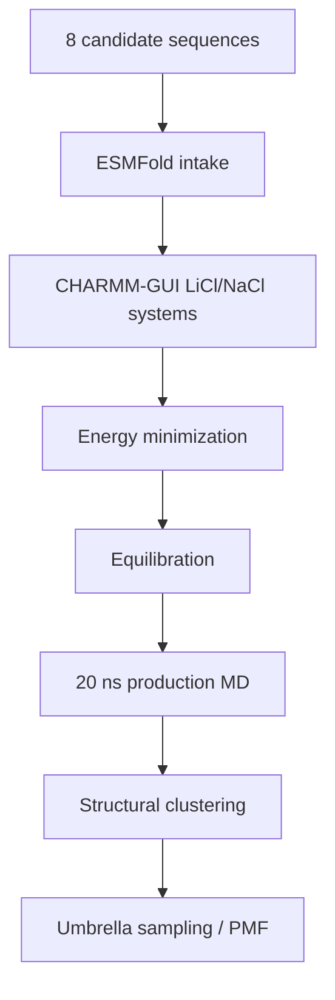

# Molecular Dynamics

This folder tracks GROMACS work for the active 8-candidate LiSPER library after ESMFold and CHARMM-GUI preparation.

## Current State

The active MD workflow now uses the final 8-candidate names. All eight ESMFold structures are ready. Seven NaCl systems minimized and equilibrated cleanly; the corrected `LiN3-Core` NaCl system is ready for the next NaCl queue. LiCl has seven GROMACS-ready systems, with only `LiN3-Core` LiCl still pending.

| Condition | Folder | Current state |
|---|---|---|
| LiCl | `li_cl/` | 7/8 systems GROMACS-ready; 2 production/clustering representatives done; 1 setup/equilibration done |
| NaCl | `na_cl/` | 7 systems equilibrated; 1 additional system ready for next queue; production/clustering pending |

Remote 8-candidate workspaces were initialized on AutoDL:

| Condition | Remote workspace |
|---|---|
| LiCl | `/root/LiSPER_remote/LiSPER_8cand_LiCl` |
| NaCl | `/root/LiSPER_remote/LiSPER_8cand_NaCl` |

## Workflow

## What Belongs Here

| Sub-area | Purpose |
|---|---|
| `remote_orchestration/` | Scripts and sync maps for the 8-candidate remote workflow |
| `li_cl/remote_runs/` | LiCl launch/status logs for the 8-candidate workflow |
| `li_cl/remote_results/` | Synced LiCl outputs for the 8-candidate workflow |
| `na_cl/remote_runs/` | NaCl launch/status logs for the 8-candidate workflow |
| `na_cl/remote_results/` | Synced NaCl outputs for the 8-candidate workflow |

Do not launch new GROMACS work for a candidate until that candidate has final-name ESMFold and matched CHARMM-GUI inputs ready.
