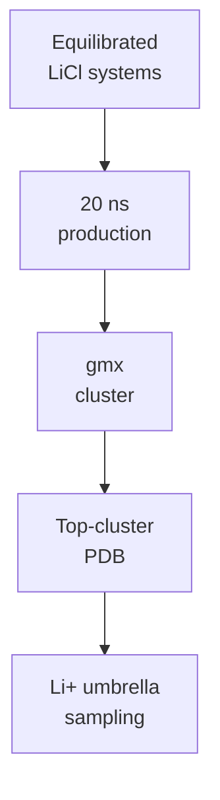

# LiCl Molecular Dynamics

Remote GROMACS workflow and synced results for peptide + LiCl systems.

## Status

| Stage | Status |
|---|---|
| CHARMM-GUI QC | 10/10 ready |
| Minimization | 10/10 complete |
| Equilibration | 10/10 complete |
| 20 ns production | `LiD3-1` and `IDP-Li-1` complete; `StrongBind-Li` running at 1.82 ns / 20 ns |
| Structural clustering | Repaired representatives ready for `LiD3-1` and `IDP-Li-1` |

Latest QC snapshot: [remote_runs/current_production_snapshot.md](remote_runs/current_production_snapshot.md).

## Current Interpretation

`LiD3-1` and `IDP-Li-1` now have complete 20 ns LiCl production trajectories. The original full-system structural-clustering handoff failed during `gmx trjconv` because the `SYSTEM` index and trajectory atom counts differ by one atom. This did not invalidate the completed production runs.

The repaired peptide-only clustering path succeeded for both candidates and produced `cluster_20ns_repair/representative_top_cluster.pdb`. Top-cluster populations are low, especially for `IDP-Li-1`, so umbrella sampling should consider whether one representative is enough or whether additional clusters should be compared.

`LiND-1`, `IDP-Li-2`, `LowCharge-Li`, and `LiD2-IDP` were skipped by the production queue because `gmx grompp` could not resolve `toppar/forcefield.itp`. The active queue has moved on to `StrongBind-Li`, which is running normally in the latest synced log.

## Key Files

| File / Folder | Purpose |
|---|---|
| `ready_gromacs_systems.tsv` | Systems passed from CHARMM-GUI QC |
| `remote_runs/` | Remote scripts, logs, and status snapshots |
| `remote_results/` | Synced GROMACS outputs |
| `remote_runs/current_production_snapshot.md` | Active production progress |
| `remote_runs/remote_status.md` | Current remote status |
| `remote_runs/production_clustering_summary.tsv` | Queue-level production and clustering summary |
| `remote_runs/clustering_repair_summary.tsv` | Repaired peptide-only clustering summary |

## Handoff Logic

Current gate: `D` has been reached for `LiD3-1` and `IDP-Li-1` through repaired peptide-only clustering.
