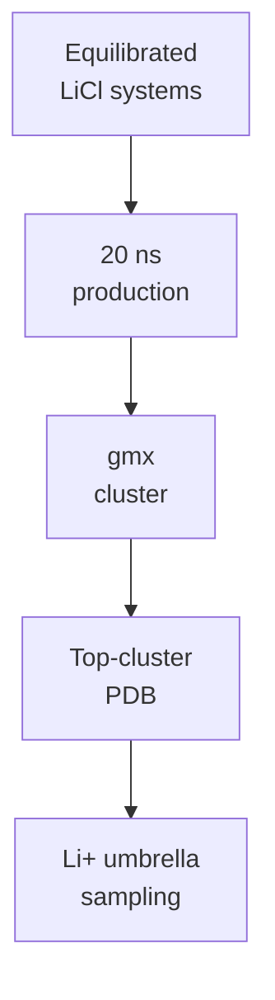

# LiCl Molecular Dynamics

Remote GROMACS workflow and synced results for peptide + LiCl systems.

## Status

| Stage | Status |
|---|---|
| CHARMM-GUI QC | 10/10 ready |
| Minimization | 10/10 complete |
| Equilibration | 10/10 complete |
| 20 ns production | `LiD3-1`, `IDP-Li-1`, and `StrongBind-Li` complete; `LiND-1` running at 0.00 ns / 20 ns |
| Structural clustering | Repaired representatives ready for `LiD3-1`, `IDP-Li-1`, and `StrongBind-Li` |

Latest QC snapshot: [remote_runs/current_production_snapshot.md](remote_runs/current_production_snapshot.md).
Last synchronized monitor snapshot: `2026-06-16 13:30 CST`.

## Current Interpretation

`LiD3-1`, `IDP-Li-1`, and `StrongBind-Li` now have complete 20 ns LiCl production trajectories. The original full-system structural-clustering handoff failed during `gmx trjconv` for the early completed systems because the `SYSTEM` index and trajectory atom counts differ by one atom. This did not invalidate the completed production runs.

The repaired peptide-only clustering path succeeded for all three completed candidates and produced `cluster_20ns_repair/representative_top_cluster.pdb`. Top-cluster populations are low, especially for `StrongBind-Li`, so umbrella sampling should consider whether one representative is enough or whether additional clusters should be compared.

`LiND-1` has entered corrected 20 ns LiCl production after the earlier topology include-path setup issue. The first synced production frame is healthy: temperature is near 300 K, constraint RMSD is small, and no fatal markers were found.

Current active-run estimate: roughly 18-25 hours remain for `LiND-1` before clustering can begin.

## Key Files

| File / Folder | Purpose |
|---|---|
| `ready_gromacs_systems.tsv` | Systems passed from CHARMM-GUI QC |
| `remote_runs/` | Remote scripts, logs, and status snapshots |
| `remote_results/` | Synced GROMACS outputs |
| `remote_runs/current_production_snapshot.md` | Active production progress |
| `remote_runs/remote_status.md` | Current remote status |
| `remote_runs/production_clustering_summary.tsv` | Queue-level production and clustering summary |
| `remote_runs/clustering_repair_summary.tsv` | Repaired peptide-only clustering summary |

## Handoff Logic

Current gate: `D` has been reached for `LiD3-1`, `IDP-Li-1`, and `StrongBind-Li` through repaired peptide-only clustering. `LiND-1` is now the active production gate.
