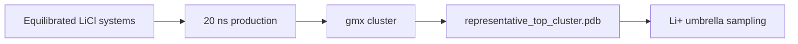

# LiCl Molecular Dynamics

Remote GROMACS workflow and synced results for peptide + LiCl systems.

## Status

| Stage | Status |
|---|---|
| CHARMM-GUI QC | 10/10 ready |
| Minimization | 10/10 complete |
| Equilibration | 10/10 complete |
| 20 ns production | `LiD3-1` complete; `IDP-Li-1` running at 16.76 ns / 20 ns |
| Structural clustering | Blocked for `LiD3-1`; no representative structure yet |

Latest QC snapshot: [remote_runs/current_production_snapshot.md](remote_runs/current_production_snapshot.md).

## Current Interpretation

`LiD3-1` now has a complete 20 ns LiCl production trajectory, but the first structural-clustering handoff failed during `gmx trjconv` because the `SYSTEM` index and trajectory atom counts differ by one atom. This does not invalidate the completed production run, but it means there is not yet a statistically selected representative structure for umbrella sampling.

`LiND-1` was skipped by the production queue because `gmx grompp` could not resolve `toppar/forcefield.itp`. The active queue has moved on to `IDP-Li-1`, which is running normally in the latest synced log.

## Key Files

| File / Folder | Purpose |
|---|---|
| `ready_gromacs_systems.tsv` | Systems passed from CHARMM-GUI QC |
| `remote_runs/` | Remote scripts, logs, and status snapshots |
| `remote_results/` | Synced GROMACS outputs |
| `remote_runs/current_production_snapshot.md` | Active production progress |
| `remote_runs/remote_status.md` | Current remote status |
| `remote_runs/production_clustering_summary.tsv` | Queue-level production and clustering summary |

## Handoff Logic

Current gate: `D` has not been reached for any LiCl candidate yet.
