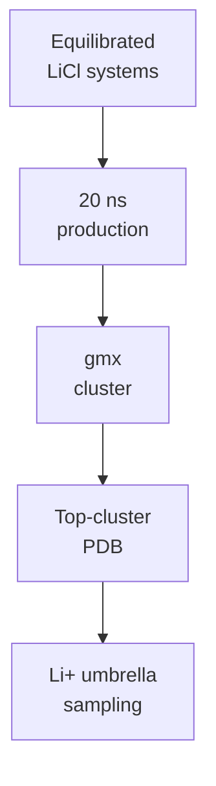

# LiCl Molecular Dynamics

Remote GROMACS workflow and synced results for peptide + LiCl systems.

## Status

| Stage | Status |
|---|---|
| CHARMM-GUI QC | 10/10 ready |
| Minimization | 10/10 complete |
| Equilibration | 10/10 complete |
| 20 ns production | `LiD3-1`, `LiND-1`, `IDP-Li-1`, and `StrongBind-Li` complete; `IDP-Li-2` running at 4.46 ns / 20 ns |
| Structural clustering | Representatives ready for `LiD3-1`, `LiND-1`, `IDP-Li-1`, and `StrongBind-Li` |

Latest QC snapshot: [remote_runs/current_production_snapshot.md](remote_runs/current_production_snapshot.md).
Last synchronized monitor snapshot: `2026-06-17 18:34 CST`.

## Current Interpretation

`LiD3-1`, `LiND-1`, `IDP-Li-1`, and `StrongBind-Li` now have complete 20 ns LiCl production trajectories. The original full-system structural-clustering handoff failed during `gmx trjconv` for the early completed systems because the `SYSTEM` index and trajectory atom counts differ by one atom. This did not invalidate the completed production runs.

The peptide-only clustering path succeeded for all four completed candidates and produced representative structures. Top-cluster populations are low, especially for `LiND-1`, so umbrella sampling should consider whether one representative is enough or whether additional clusters should be compared.

`IDP-Li-2` is now running corrected 20 ns LiCl production after the earlier topology include-path setup issue. The latest synced production frame is healthy: temperature is near 300 K, pressure is within normal small-system NPT fluctuation, constraint RMSD is small, and no fatal markers were found.

Current active-run estimate: roughly 18-22 hours remain for `IDP-Li-2` before clustering can begin.

## Key Files

| File / Folder | Purpose |
|---|---|
| `ready_gromacs_systems.tsv` | Systems passed from CHARMM-GUI QC |
| `remote_runs/` | Remote scripts, logs, and status snapshots |
| `remote_results/` | Synced GROMACS outputs |
| `remote_runs/current_production_snapshot.md` | Active production progress |
| `remote_runs/remote_status.md` | Current remote status |
| `remote_runs/production_clustering_summary.tsv` | Queue-level production and clustering summary |
| `remote_runs/clustering_repair_summary.tsv` | Repaired peptide-only clustering summary |

## Handoff Logic

Current gate: `D` has been reached for `LiD3-1`, `LiND-1`, `IDP-Li-1`, and `StrongBind-Li` through peptide-only clustering. `IDP-Li-2` is now the active production gate.
