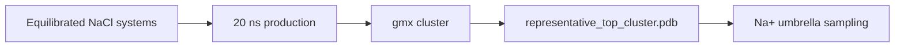

# NaCl Molecular Dynamics

Remote GROMACS workflow and synced results for peptide + NaCl systems.

## Status

| Stage | Status |
|---|---|
| CHARMM-GUI QC | 10/10 ready |
| Minimization | 10/10 complete |
| Equilibration | 10/10 complete |
| 20 ns production | Queued after LiCl production/clustering |
| Structural clustering | Queued after NaCl production runs |

## Key Files

| File / Folder | Purpose |
|---|---|
| `ready_gromacs_systems.tsv` | Systems passed from CHARMM-GUI QC |
| `remote_runs/` | Remote scripts, logs, and status snapshots |
| `remote_results/` | Synced GROMACS outputs |
| `remote_runs/current_remote_snapshot.md` | Completed minimization/equilibration status |
| `remote_runs/remote_status.md` | Current remote status |

## Handoff Logic

