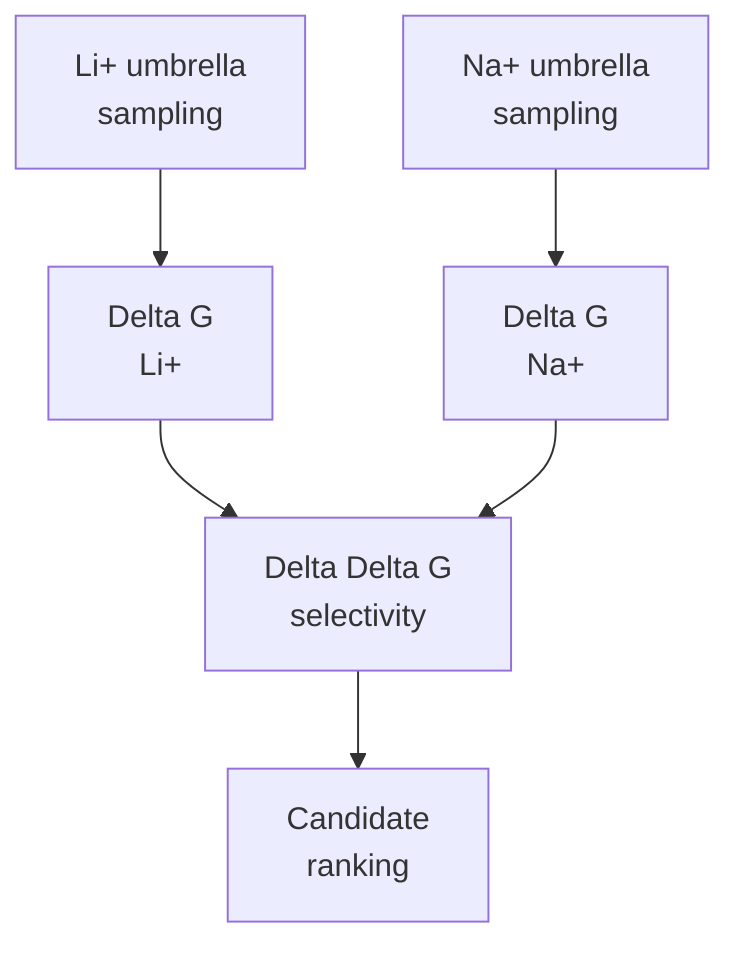

# PMF Analysis

This folder owns WHAM, PMF QC, Delta G estimates, and paired Delta Delta G selectivity analysis after umbrella sampling.

Old/default PMFs are preliminary/QC-only. A Delta G becomes publishable only after the current refined umbrella set passes WHAM overlap/bin checks, bootstrap/error analysis, and time-slice convergence review.

## Selectivity Equation

`Delta Delta G = Delta G(Li+) - Delta G(Na+)`

More negative Delta Delta G indicates stronger Li+ preference.

## Expected Outputs

| Output | Purpose |
|---|---|
| `pmf_li.tsv` | Li+ PMF curve |
| `pmf_na.tsv` | Na+ PMF curve |
| `delta_g_summary.tsv` | Per-condition free energies |
| `selectivity_summary.tsv` | Delta Delta G candidate ranking |
| convergence plots | Check whether PMFs are reliable |

## Active Layout

| Path | Purpose |
|---|---|
| `remote_runs/li_cl/pmf_qc/` | LiCl WHAM and PMF QC runs. |
| `remote_runs/na_cl/pmf_qc/` | NaCl WHAM and PMF QC runs. |
| `remote_runs/na_cl/pmf_wham/` | Refined NaCl WHAM products synced from completed v2 umbrella sets. |
| `remote_runs/na_cl/pmf_qc_repair/` | NaCl repair/diagnostic WHAM runs retained as preliminary evidence. |
| `remote_results/li_cl/` | Synced LiCl PMF products when completed and safe to store. |
| `remote_results/na_cl/` | Synced NaCl PMF products when completed and safe to store. |

## Current Refined PMF State

| Candidate | Condition | Window set | WHAM/PMF state | Delta G status |
|---|---|---:|---|---|
| `LiDA-1` | NaCl | V4 active | V3 combined WHAM/bootstrap/time-slice outputs are synced; QC summary reports `200/200` finite profile points, `9` warning lines, far-tail poor-sampling bins at `z=2.92314-2.93281 nm`, and `1.67557 kJ/mol` time-slice span shift. V4 extends the outermost PBC-safe tail window from the V3 checkpoint | Preliminary only; V4 must finish and pass combined WHAM/bootstrap/time-slice QC before Delta G promotion |
| `LiDS-1` | NaCl | V2 `27/27` | `profile_v2.xvg`, `histo_v2.xvg`, bootstrap, and time-slice outputs synced; QC summary reports `200/200` finite profile points, `0` nonfinite points, and `2` poor-sampling warning hits | Preliminary only; QC review and time-slice/bootstrap interpretation still required |

## Reliability Gates

Do not label Delta G as final when WHAM/GROMACS reports empty bins, weak/single-window bins, poor overlap, unstable time slices, or large uncertainty. Repair steps should be scientifically justified: extend weak windows, add/interpolate windows where overlap is poor, rerun WHAM with bootstrap/error analysis, and compare time-sliced convergence.

