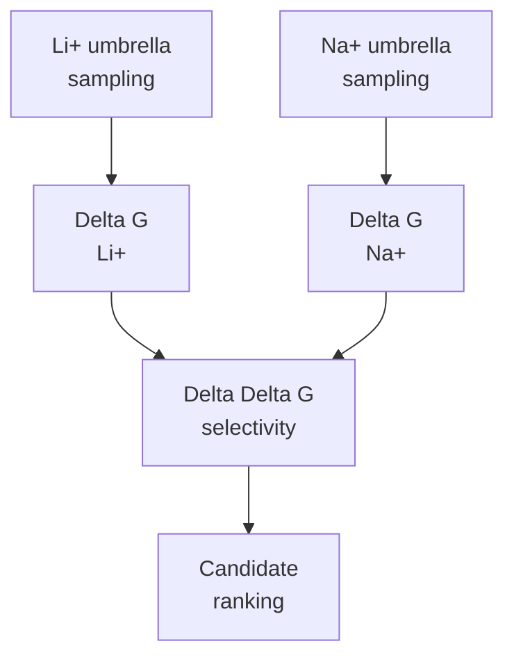

# PMF Analysis

Future folder for potential-of-mean-force analysis, Delta G estimates, and Li+/Na+ selectivity ranking.

## Selectivity Equation

`Delta Delta G = Delta G(Li+) - Delta G(Na+)`

More negative Delta Delta G indicates stronger Li+ preference.

## Expected Outputs

| Output | Purpose |
|---|---|
| `pmf_li.tsv` | Li+ PMF curve |
| `pmf_na.tsv` | Na+ PMF curve |
| `delta_g_summary.tsv` | Per-condition free energies |
| `selectivity_summary.tsv` | Delta Delta G candidate ranking |
| convergence plots | Check whether PMFs are reliable |

