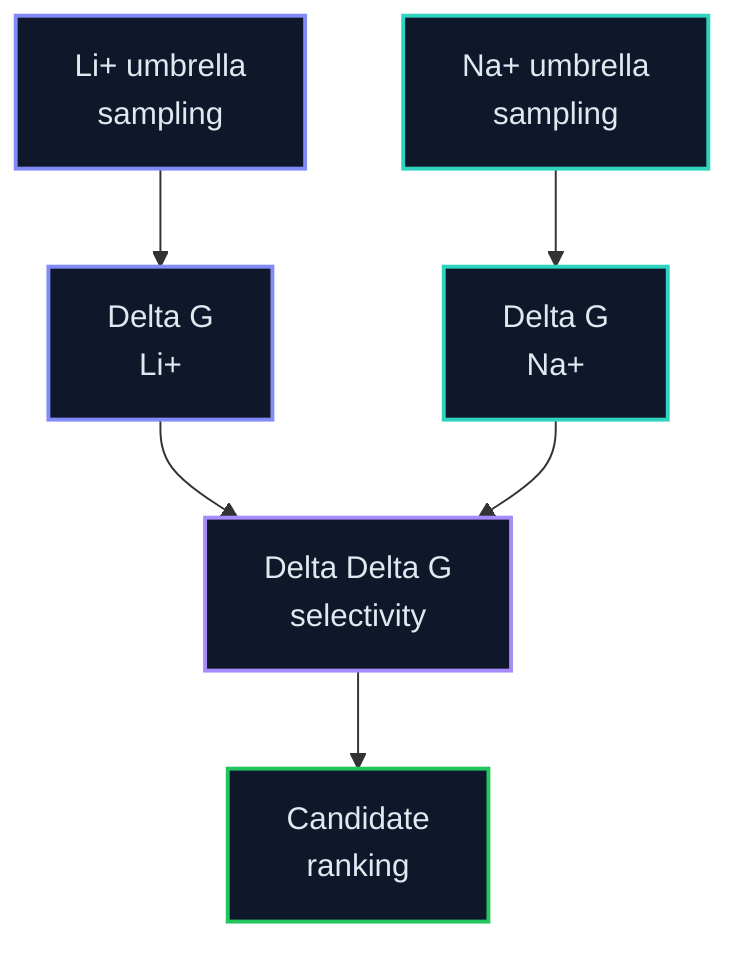

# PMF Analysis

This folder owns WHAM, PMF QC, Delta G estimates, and paired Delta Delta G selectivity analysis after umbrella sampling.

Old/default PMFs are preliminary/QC-only. A Delta G becomes publishable only after the current refined umbrella set passes WHAM overlap/bin checks, bootstrap/error analysis, and time-slice convergence review.

**Promotion hold:** active. Audit: `0/8` same-site Li/Na pairs.

Worktree keeps Part A scaffolds only. Next science: locked-site `VALIDATED_BOUND` pilot (**LiLC-1**), then scale.

Legend: 🟢 complete, 🔵 running, 🟡 queued, 🟣 QC, 🔺 repair/warning, ⚫ planned. LiCl/NaCl colors are identity accents only.

## Selectivity Equation

`Delta Delta G = Delta G(Li+) - Delta G(Na+)`

More negative Delta Delta G indicates stronger Li+ preference.

## Expected Outputs

| Output | Purpose |
|---|---|
| `pmf_li.tsv` | Li+ PMF curve |
| `pmf_na.tsv` | Na+ PMF curve |
| `delta_g_summary.tsv` | Per-condition free energies |
| `selectivity_summary.tsv` | Delta Delta G candidate ranking |
| convergence plots | Check whether PMFs are reliable |

## Active Layout

| Path | Purpose |
|---|---|
| `remote_runs/` | Empty scaffold — new locked-site WHAM/QC runs land here |
| `paired_analysis_regions/` | Shared bound/reference regions committed before PMF inspection |
| `remote_results/` | Empty scaffold — lean synced PMF products |
| Cold fat | Jacky cold disk / compute host — see `../STORAGE_LAYOUT.md` |

## Current PMF state

| Candidate | Condition | Locked-site WHAM | Publishable paired ΔΔG? |
|---|---|---|---|
| `LiLC-1` | LiCl / NaCl | pending (window production ~73%) | **No** — wait pilot QC PASS |
| Other 7 | LiCl / NaCl | queued | **No** — await pilot PASS then launch |

## Reliability Gates

Do not label Delta G as final when WHAM/GROMACS reports empty bins, weak/single-window bins, poor overlap, unstable time slices, or large uncertainty. Repair steps should be scientifically justified: extend weak windows, add/interpolate windows where overlap is poor, rerun WHAM with bootstrap/error analysis, and compare time-sliced convergence.

