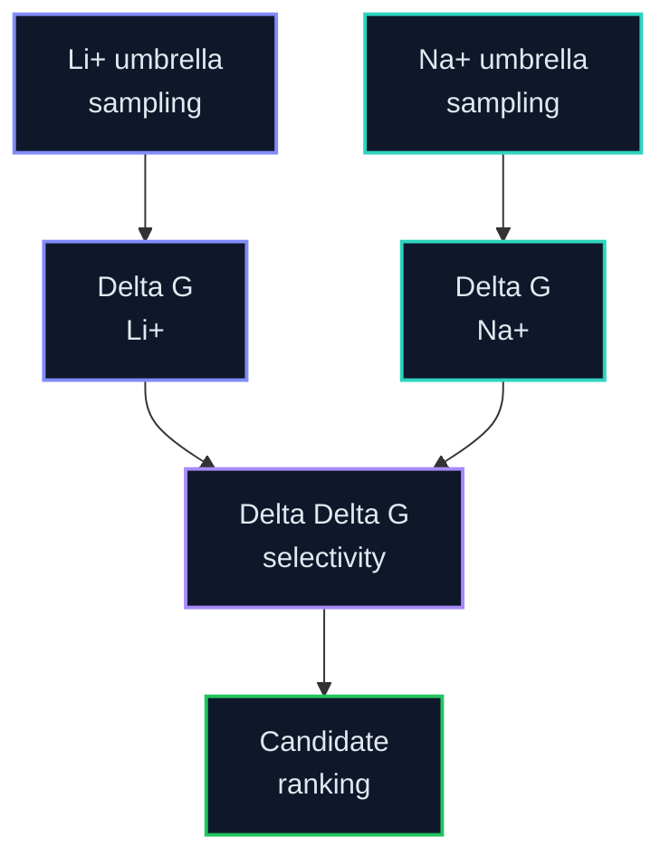

# PMF Analysis

This folder owns WHAM, PMF QC, Delta G estimates, and paired Delta Delta G selectivity analysis after umbrella sampling.

The active estimator reports radially corrected, endpoint-referenced PMF binding differences for paired Li/Na simulations. These values can support a within-protocol selectivity comparison, but they are not labeled as 1 M standard binding free energies.

No binary promotion hold is active. Histogram overlap, endpoint span, early/late differences, burn-in sensitivity, per-window IACT/ACF evidence, and autocorrelation-aware trajectory-bootstrap uncertainty are retained as diagnostics with their numerical values.

Legend: 🟢 complete, 🔵 running, 🟡 queued, 🟣 QC, 🔺 repair/warning, ⚫ planned. LiCl/NaCl colors are identity accents only.

## Selectivity Equation

`Delta Delta G = Delta G(Li+) - Delta G(Na+)`

More negative Delta Delta G indicates stronger Li+ preference.

## Expected Outputs

| Output | Purpose |
|---|---|
| `pmf_li.tsv` | Li+ PMF curve |
| `pmf_na.tsv` | Na+ PMF curve |
| `delta_g_summary.tsv` | Per-condition free energies |
| `selectivity_summary.tsv` | Delta Delta G candidate ranking |
| convergence plots | Check whether PMFs are reliable |

## Active Layout

| Path | Purpose |
|---|---|
| `remote_runs/` | Empty scaffold — new locked-site WHAM/QC runs land here |
| `paired_analysis_regions/` | Shared bound/reference regions committed before PMF inspection |
| `remote_results/` | Lean synced PMF products for validated pairs |
| Cold fat | Jacky cold disk / compute host — see `../STORAGE_LAYOUT.md` |

## Current PMF state

| Candidate | Condition | Locked-site WHAM | Publishable paired ΔΔG? |
|---|---|---|---|
| LiDA-1 | LiCl / NaCl | complete; paired WHAM and diagnostics retained | Yes — `ESTIMATE_READY` |
| Remaining 7 candidates | LiCl / NaCl | production active on EPYC | Pending completed windows and paired WHAM |

## Diagnostics

The evaluator always writes the PMF estimate when the profiles exist. Empty or weak bins, endpoint shape, time sensitivity, and uncertainty remain visible warnings rather than arbitrary universal PASS/REPAIR thresholds. Fatal GROMACS/WHAM errors and missing inputs still block calculation because there is no numerical estimate to report.

