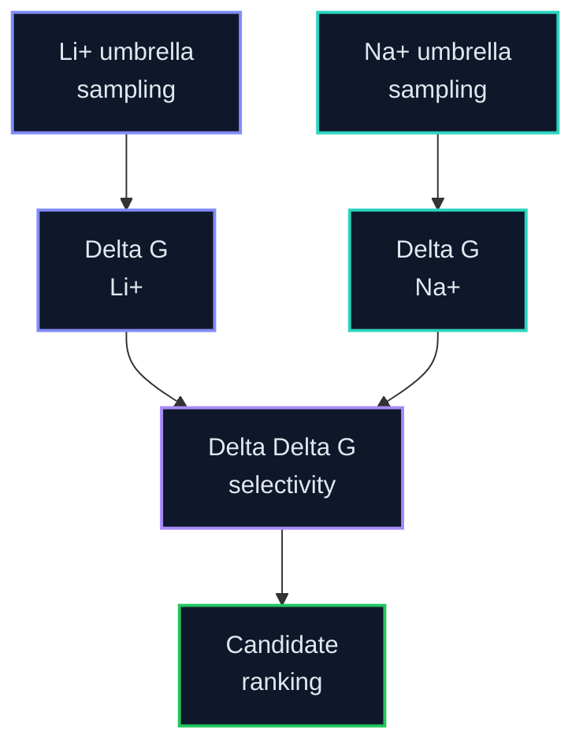

# PMF Analysis

This folder owns WHAM, PMF QC, Delta G estimates, and paired Delta Delta G selectivity analysis after umbrella sampling.

Old/default PMFs are preliminary/QC-only. A Delta G becomes publishable only after the current refined umbrella set passes WHAM overlap/bin checks, bootstrap/error analysis, and time-slice convergence review.

**Promotion hold:** active. The paired site audit found `0/8` current campaigns with identical LiCl/NaCl donor identities. Existing PMFs remain diagnostic until locked-site reruns, declared regions, and the central estimator/QC evaluator exist.

Legend: 🟢 complete, 🔵 running, 🟡 queued, 🟣 QC, 🔺 repair/warning, ⚫ planned. LiCl/NaCl colors are identity accents only.

## Selectivity Equation

`Delta Delta G = Delta G(Li+) - Delta G(Na+)`

More negative Delta Delta G indicates stronger Li+ preference.

## Expected Outputs

| Output | Purpose |
|---|---|
| `pmf_li.tsv` | Li+ PMF curve |
| `pmf_na.tsv` | Na+ PMF curve |
| `delta_g_summary.tsv` | Per-condition free energies |
| `selectivity_summary.tsv` | Delta Delta G candidate ranking |
| convergence plots | Check whether PMFs are reliable |

## Active Layout

| Path | Purpose |
|---|---|
| `remote_runs/li_cl/pmf_qc/` | LiCl WHAM and PMF QC runs. |
| `remote_runs/na_cl/pmf_qc/` | NaCl WHAM and PMF QC runs. |
| `remote_runs/na_cl/pmf_wham/` | Refined NaCl WHAM products synced from completed v2 umbrella sets. |
| `remote_runs/na_cl/pmf_qc_repair/` | NaCl repair/diagnostic WHAM runs retained as preliminary evidence. |
| `remote_results/li_cl/` | Synced LiCl PMF products when completed and safe to store. |
| `remote_results/na_cl/` | Synced NaCl PMF products when completed and safe to store. |

## Current Refined PMF State

| Candidate | Condition | Window set | WHAM/PMF state | Delta G status |
|---|---|---:|---|---|
| `LiDA-1` | LiCl | V4 `27/27` | 🔺 V4 finite, outer-tail warnings and time-slice sensitivity remain |  |
| `LiDA-1` | NaCl | V4 `25/25` | 🟣 numeric screen passed in PBC-safe region |  |
| `LiDS-1` | LiCl | V2 `27/27` | 🟣 `200/200` finite, `22` warning lines; QC review required |  |
| `LiDS-1` | NaCl | V2 `27/27` | 🟣 `200/200` finite, `2` poor-sampling warning hits |  |
| `LiD3-Flex` | paired | V3 `25/30` LiCl, `27/30` NaCl | 🔺 three endpoint guards per ion; NaCl guard repair active |  |

<strong>PMF detail notes</strong>

- `LiDA-1` LiCl V3 outputs are synced under `remote_results/gcp_lida1_licl_v3_20260702/`: `200/200` finite points, `0` nonfinite points, `11` poor-sampling warning lines at `z=2.23271-2.25490 nm`, and `2.71 kJ/mol` burn-in/time-slice span shift. Clipped diagnostics at `max=2.22` and `max=2.20 nm` still have warnings and `2.74-2.82 kJ/mol` span shift.
- `LiDA-1` LiCl V4 outputs are synced under `remote_results/gcp_lida1_licl_v4_20260703/`: V4 window `026` finished from checkpoint, WHAM/bootstrap completed with `200/200` finite profile points, `0` nonfinite points, `12` poor-sampling warning lines at `z=2.24551-2.25665 nm`, and `2.73 kJ/mol` burn-in/time-slice span shift. Classification remains repair-focused QC review.
- `LiDA-1` NaCl V4 outputs are synced under `remote_results/gcp_lida1_nacl_v4_20260701/`: full-range WHAM has `200/200` finite points but far-tail warnings; PBC-safe diagnostic `1.03-2.90 nm` has `200/200` finite points, `0` scientific warnings, and `0.56 kJ/mol` time-slice span shift.
- `LiDS-1` LiCl V2 WHAM/bootstrap completed under `pmf_wham_v2_20260703_0655/` and is synced under `remote_results/gcp_lids1_licl_v2_20260703/`: `200/200` finite points for b100/b250/b500/bootstrap, `0` nonfinite points, `22` warning lines with poor/empty far-tail bins near `z=2.48-2.53 nm`, and PMF span shift from `14.60-16.01 kJ/mol` across burn-in choices. Classification is QC review; no Delta G is promoted.
- `LiDS-1` NaCl V2 has `profile_v2.xvg`, `histo_v2.xvg`, bootstrap, and time-slice outputs synced; Delta G remains preliminary until QC review.
- `LiD3-Flex` NaCl V2 WHAM/bootstrap is synced under `remote_results/gcp_lid3flex_nacl_v2_20260712/`: all b100/b250/b500/bootstrap profiles have `200/200` finite points, the PMF-span burn-in variation is `0.34 kJ/mol`, and four poor-sampling bins remain at the outer tail (`z=2.221-2.255 nm`). Delta G remains withheld pending paired LiCl completion and manual bound/reference-region materiality review.
- LiD3-Flex V3 keeps the 27 base windows and adds three sequential endpoint guards per ion. NaCl guards are active; LiCl guards are queued until base completion. The paired rerun will use a shared interior reference plateau, true independent time blocks, and uncertainty from the bootstrap `xydy` profile under `../umbrella/LISPER_UMBRELLA_QC_PROTOCOL.md`.

## Reliability Gates

Do not label Delta G as final when WHAM/GROMACS reports empty bins, weak/single-window bins, poor overlap, unstable time slices, or large uncertainty. Repair steps should be scientifically justified: extend weak windows, add/interpolate windows where overlap is poor, rerun WHAM with bootstrap/error analysis, and compare time-sliced convergence.

