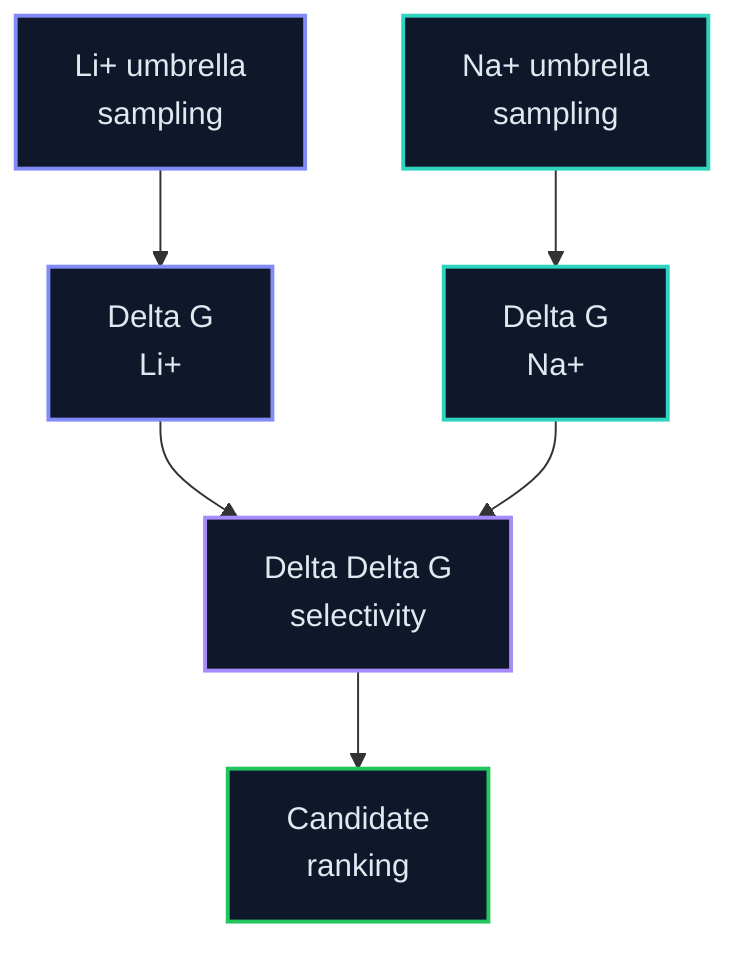

# PMF Analysis

This folder owns WHAM, PMF QC, Delta G estimates, and paired Delta Delta G selectivity analysis after umbrella sampling.

Old/default PMFs are preliminary/diagnostic only. No script assigns scientific reliability. Claims require a documented review of overlap, correlation, time dependence, replicas, estimator scope, and sensitivity.

**Promotion hold:** active. Audit: `0/8` same-site Li/Na pairs.

Worktree keeps Part A scaffolds only. Active science: **LiLC-1** force-field and reaction-coordinate correction; scale-up remains frozen pending evidence review and user approval.

Legend: 🟢 complete, 🔵 running, 🟡 queued, 🟣 QC, 🔺 repair/warning, ⚫ planned. LiCl/NaCl colors are identity accents only.

## Selectivity Equation

`Delta Delta G = Delta G(Li+) - Delta G(Na+)`

More negative Delta Delta G indicates stronger Li+ preference.

## Expected Outputs

| Output | Purpose |
|---|---|
| `pmf_li.tsv` | Li+ PMF curve |
| `pmf_na.tsv` | Na+ PMF curve |
| `paired_evidence.tsv` | Diagnostic region contrasts, overlap, IACT, time-block, replica, and uncertainty evidence |
| `selectivity_summary.tsv` | Only scientifically supported selectivity claims, with scope and limitations |
| convergence plots | Check whether PMFs are reliable |

## Active Layout

| Path | Purpose |
|---|---|
| `remote_runs/` | Empty scaffold — new locked-site WHAM/QC runs land here |
| `paired_analysis_regions/` | Region records and rationale; retired heuristic records remain marked unusable |
| `remote_results/` | Empty scaffold — lean synced PMF products |
| Cold fat | Jacky cold disk / compute host — see `../STORAGE_LAYOUT.md` |

## Current PMF state

| Candidate | Condition | Locked-site WHAM | Publishable paired ΔΔG? |
|---|---|---|---|
| `LiLC-1` | LiCl / NaCl | Diagnostic trajectories stopped near 2.22 ns/window; Na topology invalid and current coordinate permits off-site rebinding | **No** — rebuild and method proof required |
| Other 7 | LiCl / NaCl | queued | **No** — await documented pilot method review |

## Evidence policy

The former fixed numerical gates are retired. The active evidence and correction sequence is recorded in [`METHOD_VALIDATION_LEDGER.md`](METHOD_VALIDATION_LEDGER.md). Follow [`../umbrella/LISPER_UMBRELLA_QC_PROTOCOL.md`](../umbrella/LISPER_UMBRELLA_QC_PROTOCOL.md) and the preregistered [`INDEPENDENT_REPLICA_PLAN.md`](INDEPENDENT_REPLICA_PLAN.md). Report measurements and uncertainty without manufacturing a binary verdict. The current distance-coordinate estimator is diagnostic and must not be described as an absolute or standard binding free energy.

