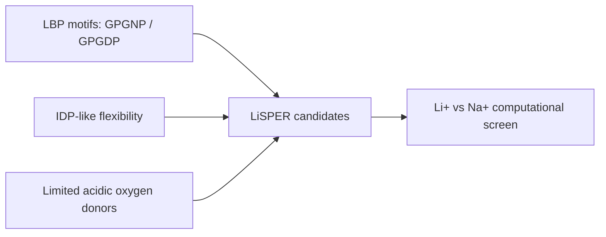

# Sequences

This folder defines the first-round LiSPER peptide library.

## Files

| File / Folder | Purpose |
|---|---|
| `candidates.tsv` | Ranked candidate metadata, design logic, and recommended-start flag |
| `candidates.fasta` | FASTA input for structure prediction |
| `candidates/` | Individual sequence records |

## Library Overview

## Recommended Starting Subset

| Candidate | Why It Matters |
|---|---|
| `LiD3-1` | Strongest motif-repeat candidate |
| `LiND-1` | Balances original and improved LBP motifs |
| `IDP-Li-1` | Compact IDP-like acidic shell |
| `LowCharge-Li` | Selectivity risk-control design |
| `Control-Negative` | Weak/neutral binding control |

Discarded historical sequences should remain outside the primary library unless explicitly used for comparison.
