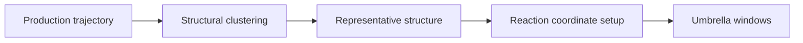

# Umbrella Sampling

Future folder for pulling/umbrella windows, run inputs, trajectories, and convergence checks.

## Entry Requirement

Umbrella sampling should start from representative structures selected after production-MD clustering.

## Recommended Metadata

| Field | Why It Matters |
|---|---|
| Candidate ID | Links umbrella result to design |
| Ion condition | LiCl or NaCl comparison branch |
| Representative structure path | Ensures reproducible starting state |
| Reaction coordinate | Defines ion-peptide separation metric |
| Window centers | PMF coverage |
| Force constants | Bias strength |
| Sampling length | Convergence interpretation |
