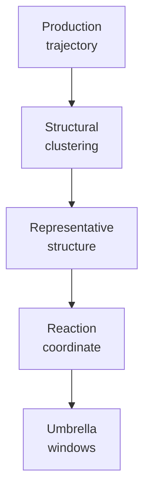

# Umbrella Sampling

This folder owns the umbrella-sampling step after MD production and representative clustering. It contains umbrella drivers, v2 reaction-coordinate metadata, pull stages, window equilibration/production logs, synced window outputs, and retained diagnostics from superseded old-parameter runs.

Latest umbrella snapshot: `2026-06-29 15:08 CST`.

## Entry Requirement

Umbrella sampling should start from representative structures selected after production-MD clustering.

## Recommended Metadata

| Field | Why It Matters |
|---|---|
| Candidate ID | Links umbrella result to design |
| Ion condition | LiCl or NaCl comparison branch |
| Representative structure path | Ensures reproducible starting state |
| Reaction coordinate | Defines ion-peptide separation metric |
| Window centers | PMF coverage |
| Force constants | Bias strength |
| Sampling length | Convergence interpretation |

## Active Layout

| Path | Purpose |
|---|---|
| `remote_runs_umbrella_sampling_status.md` | Compact umbrella status and v2 progress surface. |
| `remote_runs/li_cl/` | LiCl umbrella launch logs, v2 metadata, pulls, and windows. |
| `remote_runs/na_cl/` | NaCl umbrella launch logs, v2 metadata, pulls, and windows. |
| `remote_results/li_cl/` | Synced completed LiCl umbrella outputs. |
| `remote_results/na_cl/` | Synced completed NaCl umbrella outputs. |
| `remote_orchestration/scripts/` | Umbrella-specific local drivers. |

## Current Rule

New umbrella work should use the audited v2 strategy: dominant-cluster full-system representative, local binding-site-to-target-ion coordinate, PBC-safe pull extension from actual box vectors, denser windows, explicit window equilibration, and longer production windows. Old/default windows are retained for diagnostics and are not final Delta G evidence.
