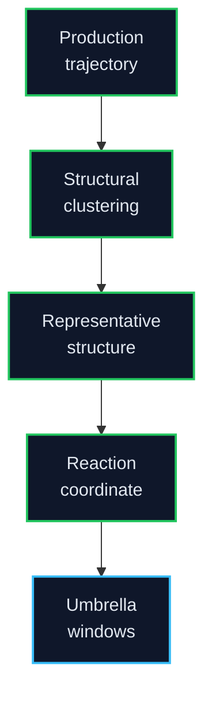

# Umbrella Sampling

This folder owns the umbrella-sampling step after MD production and representative clustering.

**Clean restart (2026-07-12):** legacy v1/v2/v3/v4 window dumps removed from git worktree and archived to Jacky 1TB (`../STORAGE_LAYOUT.md`). This tree keeps Part A only: drivers, site-lock manifests, QC protocol, empty `remote_runs/` / `remote_results/` scaffolds.

Next work: locked-site `VALIDATED_BOUND` pilot (`LiLC-1`). See `remote_runs_umbrella_sampling_status.md` and `../pmf/LEGACY_DATA_EVALUATION.md`.

## Progress Display Rule

Stage order: `Prep -> Pull -> Windows -> Umbrella MD -> QC`.

Legend: 🟢 complete, 🔵 running, 🟡 queued, 🟣 QC, 🔺 repair/warning, ⚫ planned, `◆` QC stage. LiCl/NaCl colors are identity accents only.

## Entry Requirement

Umbrella sampling should start from representative structures selected after production-MD clustering.

## Recommended Metadata

| Field | Why It Matters |
|---|---|
| Candidate ID | Links umbrella result to design |
| Ion condition | LiCl or NaCl comparison branch |
| Representative structure path | Ensures reproducible starting state |
| Reaction coordinate | Defines ion-peptide separation metric |
| Window centers | PMF coverage |
| Force constants | Bias strength |
| Sampling length | Convergence interpretation |

## Active Layout

| Path | Purpose |
|---|---|
| `remote_runs_umbrella_sampling_status.md` | Compact umbrella status and v2 progress surface. |
| `remote_runs/li_cl/` | LiCl umbrella launch logs, v2 metadata, pulls, and windows. |
| `remote_runs/na_cl/` | NaCl umbrella launch logs, v2 metadata, pulls, and windows. |
| `remote_results/li_cl/` | Synced completed LiCl umbrella outputs. |
| `remote_results/na_cl/` | Synced completed NaCl umbrella outputs. |
| `remote_orchestration/scripts/` | Umbrella-specific local drivers. |

## Current Rule

Do **not** launch or finish dynamic-nearest `umbrella_sampling_binding_site_v2` for paired ranking. Reconstruct/validate bound starts against proposed locked chemical donors, mark manifests `VALIDATED_BOUND`, then run new locked-site umbrella. Bulky legacy window binaries stay on remote disk / local laptop and are gitignored.
