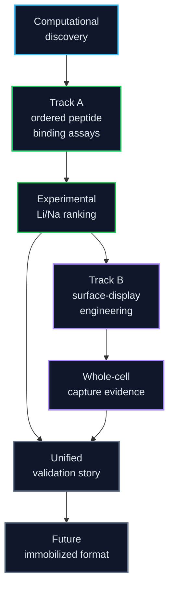

# 02 Experimental Validation

LiSPER experimental validation is organized around **two connected wet-lab tracks**.

The current strategy is fixed: LiSPER peptides for Track A are **bought as commercial synthetic peptides** (GenScript or another reliable China peptide vendor). No Track A plasmid design, bacterial culture, or His6-SUMO expression.



## Core Principle

Track A and Track B are connected validation stages.

Track A is the direct molecular test of the computational predictions. Track B is the main wet-lab engineering stage, asking whether the best peptides can become a low-cost bacterial capture material.

| Track | Folder | Scientific question | Evidence type |
|---|---|---|---|
| **Track A: Ordered synthetic peptide binding** | [`track_A_purified_peptide/`](track_A_purified_peptide/) | Do the designed LiSPER peptides bind Li+ selectively over Na+, and do experiments agree with alchemical free-energy ranking? | Molecular-recognition and computational-validation evidence |
| **Track B: Surface-display engineering** | [`track_B_surface_display/`](track_B_surface_display/) | Can top LiSPER peptides become a bacterial surface capture material for Li+ uptake, release, and reuse? | Biological-deployment and engineering evidence |

Track A is essential for proving the peptide sequence itself has measurable Li/Na behavior. Track B is essential for testing whether that molecular behavior survives on a bacterial surface and can support lithium capture/recycling.

---

## Track A: Ordered Synthetic Peptide Binding

**Purpose:** answer the fundamental molecular question.

```text
computationally ranked peptide
-> ordered synthetic peptide
-> direct Li/Na binding assay
-> experimental ranking
-> comparison with alchemical free-energy ranking
```

Track A starts from vendor-ordered synthetic LiSPER peptides. The goal is to generate direct binding statistics before committing months of work to surface-display plasmids and bacterial assays.

### What Track A Proves

- The LiSPER peptide sequence itself can bind Li+.
- Li binding can exceed Na binding under controlled conditions.
- Computational alchemical free-energy rankings can be checked against direct experimental binding data.

### What Track A Does Not Prove

- eCPX surface display works.
- Whole-cell capture works.
- Immobilized resin or packed-bed deployment works.
- Industrial raffinate tolerance.

### Main Strength

Track A is the strongest answer to reviewer concerns about attribution:

> How do you know the peptide itself, rather than the cell, scaffold, tag, or support material, is responsible for Li+/Na+ selectivity?

### Main Risk

Assay still needs controls:

- peptide purity and identity confirmation,
- buffer and plasticware ion background,
- Li/Na detection sensitivity,
- nonspecific adsorption to tubes or filters,
- appropriate negative/reference peptide controls.

### Track A Resources

[`track_A_purified_peptide/`](track_A_purified_peptide/)

| Resource | Current role |
|---|---|
| `ordering/` | GenScript/China vendor checklist and candidate sequence order table. |
| `planning/` | Ordered synthetic peptide binding plan and computational-validation logic. |
| `protocols/` | Peptide receipt/QC, Li/Na binding assays, analysis, and controls. |

Archived His6-SUMO plasmid and expression materials live under `archive/superseded_track_A_his6_sumo_production/` and are not part of the active Track A path.

---

## Track B: Surface Display Validation

**Purpose:** answer the biological deployment question.

```text
LiSPER on E. coli surface -> accessible peptide -> whole-cell Li+ capture -> Li+/Na+ selectivity
```

Track B starts only after Track A identifies promising candidates. It uses future eCPX surface-display constructs and ends with display-normalized whole-cell Li+/Na+ capture, condition optimization, and ideally capture-release-reuse data.

### What Track B Proves

- Top LiSPER peptides can be expressed and displayed on a cell surface.
- The displayed peptide is surface-accessible.
- Whole cells can capture Li+.
- Li capture can exceed Na capture under controlled conditions.
- Capture can be optimized across pH, salt, temperature, time, cell format, and regeneration cycles.

### What Track B Does Not Prove

- Purified peptide alone has intrinsic selectivity.
- Cell, scaffold, and tag effects are irrelevant unless controlled.
- Immobilized industrial media will work.

### Main Strength

Track B is now the main months-long wet-lab engineering stage. It tests a deployable biological format and directly supports future surface-display, fixed-cell, whole-cell, or immobilized biomass capture concepts.

### Main Risk

Attribution is more complex. Apparent Li binding could come from:

- eCPX scaffold effects,
- detection tag effects,
- E. coli cell-surface adsorption,
- active transport or live-cell physiology,
- local avidity from display geometry.

Therefore Track B requires matched controls: non-displaying cells, empty eCPX scaffold, `LiA3-Ref`-style low-donor reference display, live/fixed comparisons, and display-level normalization.

### Track B Resources

| Folder | Purpose |
|---|---|
| [`track_B_surface_display/planning/`](track_B_surface_display/planning/) | Integrated Track B study plan, module priorities, and professor discussion brief. |
| [`track_B_surface_display/protocols/`](track_B_surface_display/protocols/) | Surface-display validation workflow. |
| [`track_B_surface_display/assays/surface_display_assays/`](track_B_surface_display/assays/surface_display_assays/) | Whole-cell Li+/Na+ binding assay design. |
| [`track_B_surface_display/research/surface_display_host_selection/`](track_B_surface_display/research/surface_display_host_selection/) | Host, environment, and display-platform research. |
| [`track_B_surface_display/plasmids/`](track_B_surface_display/plasmids/) | Placeholder for future eCPX constructs; no eCPX plasmids designed yet. |

---

## Route Comparison

| Dimension | Track A: Ordered Peptide Binding | Track B: Surface-Display Engineering |
|---|---|---|
| Scientific question | Does the peptide itself show Li/Na behavior, and does it agree with computation? | Can the peptide become a bacterial lithium-capture material? |
| Strength | Cleanest test of computational predictions and peptide-intrinsic behavior | Application-relevant biological capture format |
| Weakness | Does not test surface immobilization or reuse | Scaffold/tag/cell effects complicate attribution |
| Publication value | High for validating the computational workflow | High for synthetic biology, biotechnology, and Bio-DLE translation |
| Technical difficulty | Moderate if peptides are ordered and ICP/assay access is available | Moderate-high |
| Cost drivers | Peptide synthesis (GenScript/China vendor), purity/QC, ICP or ion assay | Plasmids, antibodies, flow cytometry, ICP, cell controls |
| Main risk | Weak signal, assay background, or poor correlation with free-energy predictions | Background cell/scaffold binding mistaken for LiSPER binding |
| Reviewer acceptance | Strong if peptide identity, purity, controls, and free-energy comparison are clear | Strong if display, scaffold, tag, cell, and regeneration controls are rigorous |
| Best first subset | `LiA3-Ref` plus all ordered candidates or a top computational subset | Empty scaffold, `LiA3-Ref`, top 2-3 peptide hits |
| Key readout | Li/Na binding and experimental-vs-computational ranking | Whole-cell Li/Na uptake normalized by biomass and display level |

---

## Evidence Layers

| Evidence layer | Experiment | What it proves | What it does not prove |
|---|---|---|---|
| Computational evidence | ESMFold, MD, clustering, alchemical free-energy | Candidates have rational Li/Na selectivity hypotheses and rankable predictions. | Real binding occurs experimentally. |
| Track A evidence | Ordered synthetic peptide Li/Na assays compared with alchemical free-energy ranking | Peptide sequence itself can recognize Li+ preferentially over Na+, and computation has experimental support. | Surface display or industrial deployment works. |
| Track B evidence | eCPX display, surface verification, whole-cell Li/Na capture, optimization, reuse | LiSPER can function on a biological surface as a capture material. | Binding is solely peptide-intrinsic without scaffold/cell contribution. |
| Future immobilized evidence | Peptide on beads/resin, packed-bed testing | LiSPER can become a reusable capture material. | Mechanism is identical to Track A or Track B. |

---

## Reviewer-Facing Logic

Track A addresses:

- How do you know the peptide itself binds lithium?
- Could binding come from the tag, fusion partner, cell surface, or material support?
- Does computational design correspond to molecular behavior?

Track B addresses:

- Can the peptide function when deployed on a biological surface?
- Is surface expression accessible?
- Can whole cells capture Li+ over Na+?
- Can capture and release be optimized for reuse?
- Is this plausible as a Bio-DLE precursor?

Together:

```text
Track A validates LiSPER as a molecular recognition element and tests whether alchemical free-energy ranking is predictive.
Track B validates LiSPER as a biological deployment interface and optimization platform.
Together, they connect computational design to mechanism, assay evidence, and application.
```

---

## Decision Gates

| Gate | Advance if | Redirect if |
|---|---|---|
| Computational to Track A | Candidate has plausible structure/free-energy behavior and can be ordered as a peptide. | Redesign sequence, reduce candidate set, or deprioritize. |
| Track A to molecular claim | Ordered peptide identity/purity is acceptable and Li/Na selectivity exceeds controls. | Troubleshoot assay background, peptide solubility, or detection method. |
| Track A to Track B | Synthetic peptide data identifies top candidates and controls for display. | Delay plasmid design until peptide statistics are interpretable. |
| Track B to deployment research | Displayed cells show Li selectivity above scaffold/cell controls and retain function under useful conditions. | Revise tag/linker/scaffold, cell format, or assay conditions. |
| Validation to immobilization | At least one candidate has Track A and/or Track B evidence. | Continue validation before industrial claims. |

---

## Publication Strategy

A strong manuscript package would include:

- computational candidate-design rationale,
- MD/alchemical free-energy ranking for Li+ vs Na+,
- Track A ordered-peptide Li/Na data for candidates plus `LiA3-Ref`,
- experimental-vs-computational ranking comparison,
- Track B surface-display evidence for top peptide hits plus empty scaffold and `LiA3-Ref`,
- Track B condition optimization and, if feasible, capture-release-reuse data,
- clear discussion of what each route proves and does not prove.

Appropriate claims:

- "De novo designed IDP-like peptides show evidence of Li+/Na+ selectivity."
- "Surface display preserves LiSPER function in a whole-cell capture format."
- "Computational ranking can guide experimental validation of lithium-selective peptides."
- "Displayed LiSPER cells can be optimized as a reusable lithium-capture material."

Claims to avoid until future data exist:

- "Industrial lithium recovery is demonstrated."
- "LiSPER is ready for real battery raffinate."
- "Surface-display binding proves peptide-intrinsic selectivity without purified peptide evidence."
- "Purified peptide binding proves whole-cell or immobilized deployment."

---

## Final Framework

```text
Computational evidence identifies candidates and predicts ranking.
Ordered peptide assays test molecular recognition directly.
Surface-display engineering tests biological capture, optimization, and reuse.
Immobilized peptide evidence will test process translation.
```

The combined evidence is stronger than any single route because it separates mechanism from deployment while still connecting both to the long-term Bio-DLE vision.
