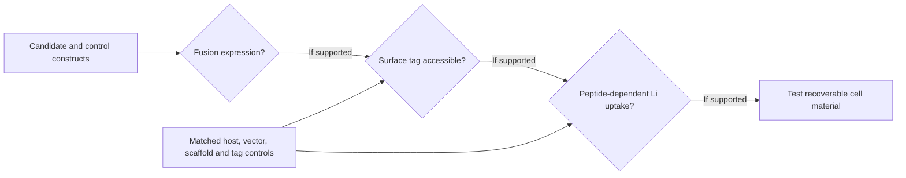

# Experimental validation

The immediate goal is to test whether LiSPER's computationally prioritized peptides produce measurable Li⁺ uptake and Li⁺/Na⁺ selectivity when displayed on bacterial cells. **No expression, surface-display, or ion-capture result has been reported yet.** The project lead has submitted the final pET-11a designs to the vendor; experimental work awaits the constructs.

## Constructs and controls

The [pET-11a package](plasmids/pET-11a/README.md) holds four candidate fusions: LiDA-1 and LiND-Hybrid, each designed for N-side and C-side eCPX display with His6 on the opposite side. It also holds tag-free and N-/C-His6 scaffold controls, plus the reference backbone. The peptide and tag placement must be interpreted together; a positive anti-His signal does not directly prove that the opposite-side peptide is exposed or functional.

The pET-11a/T7 design calls for **BL21(DE3) or another host with T7 RNA polymerase**. The eCPX display literature cited in the plasmid README used a different vector and host, so this combination still needs experimental validation.

## Planned evidence chain

1. **Fusion expression:** check the expected fusion band with an anti-His immunoblot and gel analysis. This tests fusion expression, not lithium binding or peptide identity by itself.
2. **Surface accessibility:** compare intact-cell anti-His staining, including microscopy, before and after a surface-protease treatment. A reduced signal would support accessibility of the tagged side, subject to controls for cell integrity and nonspecific staining.
3. **Ion uptake:** after a wash suitable for minimizing medium-derived sodium, compare measured Li⁺ and Na⁺ concentrations before and after contact with cells. The planned initial readout uses Li-only, Na-only, and mixed-ion solutions, a provisional 30-minute contact period, and a bacterial-dose range (proposed final OD₆₀₀ 3, 5, and 7). Conditions will be finalized with the laboratory and analytical facility.
4. **Material format:** only after a reproducible peptide-dependent effect is established, test whether inactivated, immobilized cell material retains capture and can be separated. Magnetic beads provide a benchmark.

## Comparison and interpretation

Use matched no-cell, host-only, empty-vector, scaffold-only, and tag-placement controls. Compare independent cultures when claiming biological reproducibility. OD₆₀₀ is a biomass proxy, not a count of displayed peptides. Use measured starting concentrations and the original assay volume for uptake calculations; retain raw concentrations, dilution factors, and analytical uncertainty.

A concentration drop alone does not establish peptide-specific binding: background adsorption, carryover, and measurement effects must be evaluated with the controls above. The chemistry facility will set instrument-specific preparation and measurement requirements, and biological work will follow the host laboratory's procedures.

Supporting sources: [Li⁺ assay literature](../04_reference_library/li_assay/), [surface-display designs](plasmids/pET-11a/README.md), and [industrial translation questions](../03_industrial_translation/).
