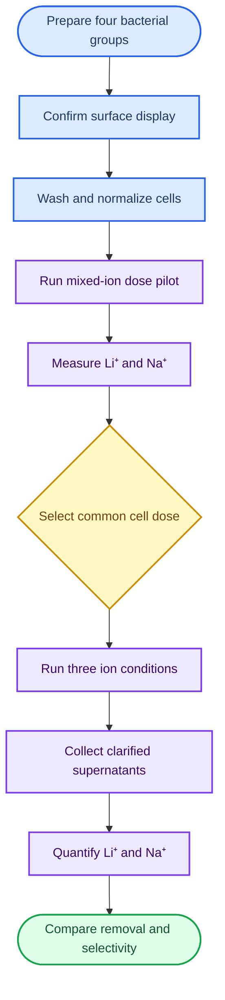

# Experimental validation

_Current wet-lab plan for testing LiSPER peptide candidates by bacterial surface display and Li⁺/Na⁺ analysis_

---

## 📋 Overview

This phase tests whether the computationally selected peptides **LiDA-1** and **LiND-Hybrid** produce measurable Li⁺ uptake and Li⁺-over-Na⁺ selectivity when displayed on the surface of _E. coli_. The current route avoids purchasing or purifying free peptides: each candidate is displayed using an eCPX-style surface-display construct, compared with matched bacterial controls, and evaluated from the change in ion concentration in the clarified incubation supernatant.

Direct free-peptide production, purification, and NHS-bead immobilization are deferred from this round because of the available equipment and budget.

The plan answers four experimental questions:

1. Does each candidate remove more Li⁺ from solution than the eCPX scaffold-only and host-only controls?
2. Does the candidate effect increase with bacterial dose?
3. In a mixed Li⁺/Na⁺ solution, is Li⁺ removal greater than Na⁺ removal?
4. Can the effect be reproduced across independent bacterial cultures?

## 🧭 Workflow



## 📋 Experimental groups

| Group | Surface construct | Purpose |
| --- | --- | --- |
| **LiDA-1** | eCPX–LiDA-1 | Candidate 1 |
| **LiND-Hybrid** | eCPX–LiND-Hybrid | Candidate 2 |
| **Scaffold-only** | eCPX without candidate peptide | Display-system background |
| **Host-only** | Untransformed host strain | Native-cell background |

Surface display will be checked with a whole-cell surface immunoassay, such as ELISA against an extracellular epitope tag. Cell suspensions will then be normalized by `OD₆₀₀`; this is a biomass proxy rather than an exact peptide or cell count.

## ⚙️ Proposed assay conditions

| Parameter | Proposed setting |
| --- | --- |
| Reaction volume | `2.0 mL` |
| Cell input | `1.0 mL` washed cell suspension |
| Ion input | `1.0 mL` of `2×` ion solution |
| Final Li⁺ concentration | `1.0 mM` where present |
| Final Na⁺ concentration | `1.0 mM` where present |
| Assay buffer | Defined low-sodium buffer compatible with the analytical method |
| Incubation | `30 min`, `25 °C`, orbital mixing at `250 rpm` |
| Clarification | Centrifuge cells and transfer a fixed supernatant volume without disturbing the pellet |
| Ion analysis | Cation-exchange IC with conductivity detection or ICP-OES, subject to facility validation |
| Replication | Three independent bacterial cultures per biological condition |

The measured no-cell control, not the nominal `1.0 mM` preparation value, is the baseline for all removal calculations. No post-incubation wash is performed before supernatant collection because it would change the measured solution concentration.

## 📊 Stage 1: bacterial dose pilot

The pilot uses the **mixed condition** (`1.0 mM Li⁺ + 1.0 mM Na⁺`) to find one common bacterial dose for the confirmation experiment.

| Cell suspension before mixing | Final reaction `OD₆₀₀` | Use |
| ---: | ---: | --- |
| `OD₆₀₀ = 6` | `3` | Low dose |
| `OD₆₀₀ = 10` | `5` | Medium dose |
| `OD₆₀₀ = 14` | `7` | High dose |
| No cells | `0` | Solution stability control |

Planned pilot size:

- LiDA-1, LiND-Hybrid, and scaffold-only: `3 doses × 3 cultures = 9` samples per group
- Host-only: final `OD₆₀₀ = 5 × 3 cultures = 3` samples
- No-cell mixed-ion control: `3` samples
- **Total: 33 samples**

Select the lowest common dose at which both candidates separate from the scaffold-only control beyond the validated analytical uncertainty, show the same effect direction across all three cultures, and show greater Li⁺ than Na⁺ removal.

## ✅ Stage 2: confirmation matrix

At the selected final `OD₆₀₀`, test every bacterial group under all three ion conditions.

| Condition | Final composition | Question answered |
| --- | --- | --- |
| **Li-only** | `1.0 mM Li⁺` | Li⁺ uptake capacity under the assay condition |
| **Na-only** | `1.0 mM Na⁺` | Na⁺ background uptake |
| **Mixed** | `1.0 mM Li⁺ + 1.0 mM Na⁺` | Competitive Li⁺-over-Na⁺ behavior |

The confirmation stage contains `4 bacterial groups × 3 conditions × 3 cultures = 36` biological samples, plus `3 conditions × 3 replicates = 9` no-cell controls, for **45 samples total**.

## 📊 Readouts and calculations

For each ion, define:

- `C₀`: concentration in the matched no-cell control
- `Cₑ`: concentration in the clarified supernatant after bacterial incubation
- `V`: original reaction volume, `2.0 mL`

```text
Apparent amount removed = (C₀ − Cₑ) × V
Removal (%)             = (C₀ − Cₑ) / C₀ × 100
Candidate-specific amount = (C_scaffold-only − C_candidate) × V
Mixed-ion preference      = Li⁺ removal (%) − Na⁺ removal (%)
```

Use the original `2.0 mL` reaction volume in amount calculations, not the smaller supernatant aliquot submitted for analysis. Report raw concentrations, dilution factors, analytical uncertainty, and all control-corrected values.

## 🔍 Quality controls

| Control | What it checks |
| --- | --- |
| **No-cell solution** | Ion stability, vessel adsorption, and analytical baseline |
| **Scaffold-only cells** | Uptake caused by eCPX and the engineered cell surface |
| **Host-only cells** | Uptake caused by native _E. coli_ |
| **Final wash sample** | Residual Na⁺ and culture-medium carryover |
| **Surface-display assay** | Candidate exposure on the external cell surface |
| **Independent cultures** | Biological reproducibility |

Samples should be processed in a balanced order and submitted to the analytical facility with matrix-matched blanks and standards as requested by its standard operating procedure.

## 📌 Parameters requiring confirmation

- Final eCPX plasmid, extracellular tag design, and display-compatible _E. coli_ strain
- Induction conditions and the acceptance criterion for surface-display QC
- Low-sodium buffer composition compatible with both the cells and selected instrument
- Instrument method, calibration range, detection limit, dilution, filtration, and acidification requirements
- Minimum detectable candidate-versus-control difference used for the dose decision

All biological work must follow the host laboratory's biosafety procedures, and all analytical preparation must follow the chemistry facility's instrument-specific SOP.

## 🔗 Supporting material

- [Li⁺ assay references](../04_reference_library/li_assay/)
- [Peptide-processing references](../04_reference_library/peptide_processing/)
- [Plasmid-design references](../04_reference_library/plasmid_design/)
- [Selectivity-assay references](../04_reference_library/selectivity_assay/)

---

_Status: experimental design established; construct and analytical-method details pending facility confirmation._
