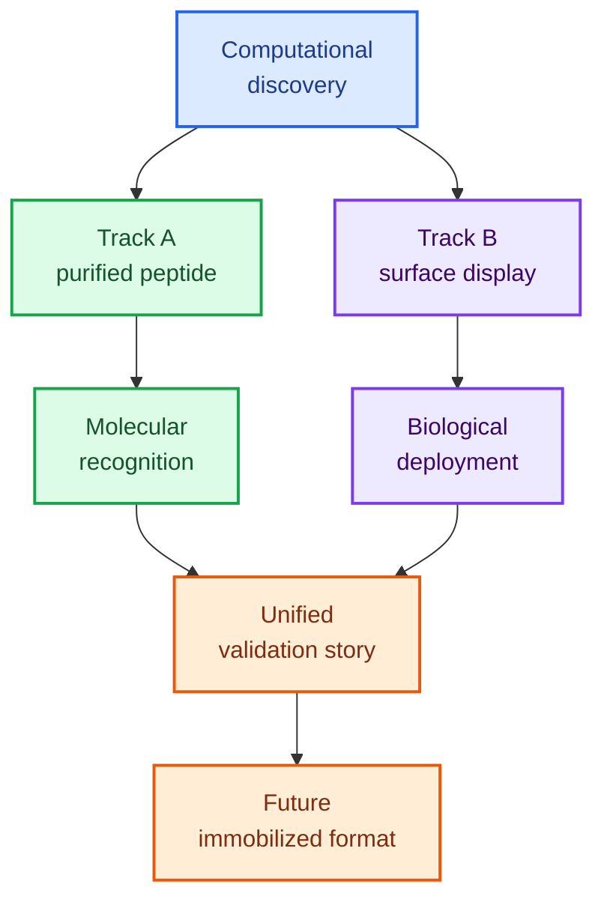

# 02 Experimental Validation

LiSPER experimental validation is organized around **two complementary tracks** that answer different scientific questions.



## Core Principle

Track A and Track B are **parallel validation tracks**, not backup plans for each other.

| Track | Folder | Scientific question | Evidence type |
|---|---|---|---|
| **Track A: Purified Peptide** | [`track_A_purified_peptide/`](track_A_purified_peptide/) | Does the LiSPER peptide itself selectively recognize Li+ over Na+? | Molecular-recognition evidence |
| **Track B: Surface Display** | [`track_B_surface_display/`](track_B_surface_display/) | Can LiSPER remain functional when displayed on a biological surface? | Biological-deployment evidence |

Track A is essential for attribution to the peptide sequence itself. Track B is essential for testing whether LiSPER can function in a deployable biological display format.

---

## Track A: Purified Peptide Validation

**Purpose:** answer the fundamental molecular question.

```text
LiSPER peptide -> binds Li+ -> preferentially over Na+
```

Track A starts from the existing His6-SUMO-LiSPER plasmids and ends with purified or recovered peptide Li+/Na+ binding data.

### What Track A Proves

- The LiSPER peptide sequence itself can bind Li+.
- Li binding can exceed Na binding under controlled conditions.
- Computational predictions have molecular experimental support.

### What Track A Does Not Prove

- eCPX surface display works.
- Whole-cell capture works.
- Immobilized resin or packed-bed deployment works.
- Industrial raffinate tolerance.

### Main Strength

Track A is the strongest answer to reviewer concerns about attribution:

> How do you know the peptide itself, rather than the cell, scaffold, tag, or support material, is responsible for Li+/Na+ selectivity?

### Main Risk

Technical difficulty:

- low peptide yield,
- peptide instability,
- SUMO cleavage difficulty,
- native peptide recovery loss,
- small-peptide QC challenges.

These are **production and recovery challenges**, not scientific proof that LiSPER lacks selectivity.

### Track A Protocols

Track A now has modular bench protocols:

[`track_A_purified_peptide/protocols/`](track_A_purified_peptide/protocols/)

| Order | Protocol |
|---:|---|
| 00 | Protocol overview |
| 01 | Transformation |
| 02 | Colony selection and overnight culture |
| 03 | Small-scale expression test |
| 04 | Expression optimization |
| 05 | Harvest, lysis, and clarification |
| 06 | Ni-NTA purification |
| 07 | Buffer exchange and SUMO cleavage |
| 08 | Native peptide recovery |
| 09 | Peptide QC, storage, and stability |
| 10 | Purified peptide Li+/Na+ binding assays |
| 11 | Data analysis and interpretation |
| 12 | Controls and troubleshooting |

---

## Track B: Surface Display Validation

**Purpose:** answer the biological deployment question.

```text
LiSPER on E. coli surface -> accessible peptide -> whole-cell Li+ capture -> Li+/Na+ selectivity
```

Track B starts from future eCPX surface-display constructs and ends with whole-cell Li+/Na+ selectivity data.

### What Track B Proves

- LiSPER can be expressed and displayed on a cell surface.
- The displayed peptide is surface-accessible.
- Whole cells can capture Li+.
- Li capture can exceed Na capture under controlled conditions.

### What Track B Does Not Prove

- Purified peptide alone has intrinsic selectivity.
- Cell, scaffold, and tag effects are irrelevant unless controlled.
- Immobilized industrial media will work.

### Main Strength

Track B tests a deployable biological format and directly supports future surface-display or whole-cell capture concepts.

### Main Risk

Attribution is more complex. Apparent Li binding could come from:

- eCPX scaffold effects,
- detection tag effects,
- E. coli cell-surface adsorption,
- active transport or live-cell physiology,
- local avidity from display geometry.

Therefore Track B requires matched controls: non-displaying cells, empty eCPX scaffold, Control-Negative display, live/fixed comparisons, and display-level normalization.

### Track B Resources

| Folder | Purpose |
|---|---|
| [`track_B_surface_display/protocols/`](track_B_surface_display/protocols/) | Surface-display validation workflow. |
| [`track_B_surface_display/assays/surface_display_assays/`](track_B_surface_display/assays/surface_display_assays/) | Whole-cell Li+/Na+ binding assay design. |
| [`track_B_surface_display/research/surface_display_host_selection/`](track_B_surface_display/research/surface_display_host_selection/) | Host, environment, and display-platform research. |
| [`track_B_surface_display/plasmids/`](track_B_surface_display/plasmids/) | Placeholder for future eCPX constructs; no eCPX plasmids designed yet. |

---

## Route Comparison

| Dimension | Track A: Purified Peptide | Track B: Surface Display |
|---|---|---|
| Scientific question | Intrinsic peptide Li+/Na+ recognition | Function of LiSPER on a cell surface |
| Strength | Strong molecular attribution | Application-relevant biological format |
| Weakness | Small peptide recovery and QC are difficult | Scaffold/tag/cell effects complicate attribution |
| Publication value | High for fundamental peptide design and biochemistry | High for synthetic biology and biotechnology validation |
| Technical difficulty | Moderate-high | Moderate-high |
| Cost drivers | Expression, purification, SUMO protease, MS/ICP | Antibodies, flow cytometry, ICP, cell controls |
| Main risk | Technical recovery failure mistaken for peptide failure | Background cell/scaffold binding mistaken for LiSPER binding |
| Reviewer acceptance | Strong if peptide identity, purity, and controls are clear | Strong if display, scaffold, tag, and cell controls are rigorous |
| Best first subset | Control-Negative plus 2-4 top candidates | Empty scaffold, Control-Negative, 2-4 top candidates |
| Key readout | Li/Na binding by purified peptide | Whole-cell Li/Na uptake normalized by cells and display level |

---

## Evidence Layers

| Evidence layer | Experiment | What it proves | What it does not prove |
|---|---|---|---|
| Computational evidence | ESMFold, MD, clustering, umbrella sampling, PMF | Candidates have rational Li/Na selectivity hypotheses and rankable predictions. | Real binding occurs experimentally. |
| Track A evidence | His6-SUMO expression, cleavage, peptide recovery, Li/Na assays | Peptide sequence itself can recognize Li+ preferentially over Na+. | Surface display or industrial deployment works. |
| Track B evidence | eCPX display, surface verification, whole-cell Li/Na capture | LiSPER can function on a biological surface. | Binding is solely peptide-intrinsic without scaffold/cell contribution. |
| Future immobilized evidence | Peptide on beads/resin, packed-bed testing | LiSPER can become a reusable capture material. | Mechanism is identical to Track A or Track B. |

---

## Reviewer-Facing Logic

Track A addresses:

- How do you know the peptide itself binds lithium?
- Could binding come from the tag, fusion partner, cell surface, or material support?
- Does computational design correspond to molecular behavior?

Track B addresses:

- Can the peptide function when deployed on a biological surface?
- Is surface expression accessible?
- Can whole cells capture Li+ over Na+?
- Is this plausible as a Bio-DLE precursor?

Together:

```text
Track A validates LiSPER as a molecular recognition element.
Track B validates LiSPER as a biological deployment interface.
Together, they connect computational design to both mechanism and application.
```

---

## Decision Gates

| Gate | Advance if | Redirect if |
|---|---|---|
| Computational to Track A | Candidate has plausible structure/PMF behavior and expression feasibility. | Redesign sequence or deprioritize. |
| Track A to molecular claim | Peptide identity confirmed and Li/Na selectivity exceeds controls. | Troubleshoot production, recovery, or assay separation. |
| Computational to Track B | Candidate is prioritized and construct can include rigorous controls. | Delay plasmid design until assay controls are defined. |
| Track B to deployment research | Displayed cells show Li selectivity above scaffold/cell controls. | Revise tag/linker/scaffold or improve controls. |
| Validation to immobilization | At least one candidate has Track A and/or Track B evidence. | Continue validation before industrial claims. |

---

## Publication Strategy

A strong manuscript package would include:

- computational candidate-design rationale,
- MD/PMF ranking for Li+ vs Na+,
- Track A data for top candidates plus Control-Negative,
- Track B surface-display evidence for top candidates plus empty scaffold and Control-Negative,
- clear discussion of what each route proves and does not prove.

Appropriate claims:

- "De novo designed IDP-like peptides show evidence of Li+/Na+ selectivity."
- "Surface display preserves LiSPER function in a whole-cell capture format."
- "Computational ranking can guide biological validation of lithium-selective peptides."

Claims to avoid until future data exist:

- "Industrial lithium recovery is demonstrated."
- "LiSPER is ready for real battery raffinate."
- "Surface-display binding proves peptide-intrinsic selectivity without purified peptide evidence."
- "Purified peptide binding proves whole-cell or immobilized deployment."

---

## Final Framework

```text
Computational evidence identifies candidates.
Purified peptide evidence tests molecular recognition.
Surface-display evidence tests biological deployment.
Immobilized peptide evidence will test process translation.
```

The combined evidence is stronger than any single route because it separates mechanism from deployment while still connecting both to the long-term Bio-DLE vision.
