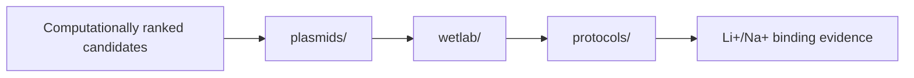

# 02 Experimental Validation

This stage contains the wet-lab validation path for LiSPER: current His6-SUMO-LiSPER plasmid designs, expression/purification planning, binding-assay planning, and experimental protocols.

## Contents

| Folder | Purpose |
|---|---|
| `plasmids/` | Current vendor-ready His6-SUMO-LiSPER constructs, vector maps, and design review. |
| `wetlab/` | Expression, purification, SUMO cleavage, peptide recovery, and assay planning. |
| `protocols/` | Reproducible experimental protocols and operating notes. |

Superseded direct His/T7-LiSPER plasmids were moved to `../archive/superseded_plasmid_designs/`.

