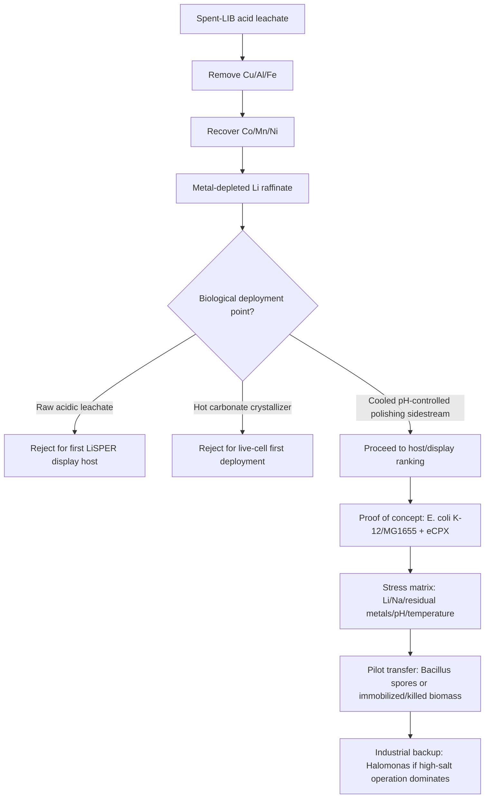

# Assessment Flow

The review used the following decision logic.

```mermaid
flowchart TD
    A["Spent-LIB acid leachate"] --> B["Remove Cu/Al/Fe"]
    B --> C["Recover Co/Mn/Ni"]
    C --> D["Metal-depleted Li raffinate"]
    D --> E{"Biological deployment point?"}
    E -->|Raw acidic leachate| F["Reject for first LiSPER display host"]
    E -->|Hot carbonate crystallizer| G["Reject for live-cell first deployment"]
    E -->|Cooled pH-controlled polishing sidestream| H["Proceed to host/display ranking"]
    H --> I["Proof of concept: E. coli K-12/MG1655 + eCPX"]
    I --> J["Stress matrix: Li/Na/residual metals/pH/temperature"]
    J --> K["Pilot transfer: Bacillus spores or immobilized/killed biomass"]
    K --> L["Industrial backup: Halomonas if high-salt operation dominates"]
```

