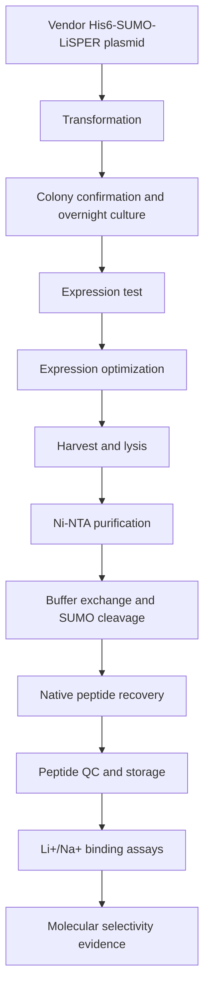

# Track A: Purified Peptide Validation

Track A answers the molecular-recognition question:

> Does the LiSPER peptide itself selectively recognize Li+ over Na+?

This track uses the current His6-SUMO-LiSPER plasmids to express soluble fusion proteins, cleave SUMO, recover native LiSPER peptides, and test Li+/Na+ binding directly.

## Contents

| Folder | Purpose |
|---|---|
| `plasmids/` | Current His6-SUMO-LiSPER plasmid package and vector records. |
| `protocols/` | Ordered Track A protocols from transformation through binding-data analysis. |

## Start Here

1. Read `protocols/00_track_A_protocol_overview.md`.
2. Use `protocols/README.md` as the ordered protocol index.
3. Start with `Control-Negative` plus 2-4 priority candidates before scaling to all 10.
