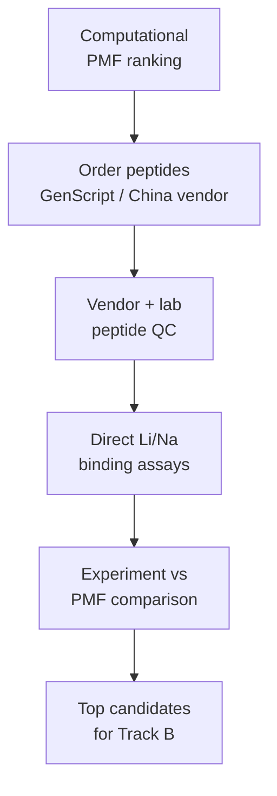

# Track A: Ordered Synthetic Peptide Binding

Track A answers the molecular-recognition question:

> Does the LiSPER peptide itself selectively recognize Li+ over Na+?

**Active path:** buy synthetic LiSPER peptides from a commercial peptide vendor (GenScript or another reliable China peptide company), confirm QC, run Li+/Na+ binding assays, compare experimental ranking with computational PMF ranking, then shortlist candidates for Track B surface display.

**Not used:** in-house plasmid design, bacterial culture, or His6-SUMO expression/purification. Those materials are archived under `archive/superseded_track_A_his6_sumo_production/`.

## Contents

| Folder | Purpose |
|---|---|
| `ordering/` | Vendor order checklist, candidate sequence table, and GenScript-style purchase notes. |
| `planning/` | Assay strategy and computational-validation logic. |
| `protocols/` | Peptide receipt/QC, Li/Na binding assays, analysis, and controls. |

## Start Here

1. Read `ordering/vendor_peptide_order_checklist.md` and confirm sequences in `ordering/candidate_order_table.csv`.
2. Place order with GenScript or equivalent China peptide vendor.
3. On receipt, follow `protocols/01_peptide_receipt_qc_storage.md`.
4. Run Li-only, Na-only, and Li+Na competition assays (`protocols/02_li_na_binding_assays.md`).
5. Analyze and compare with PMF ranking (`protocols/03_data_analysis_interpretation.md`).
6. Advance top 2–3 hits plus `LiA3-Ref` to Track B surface-display design.
