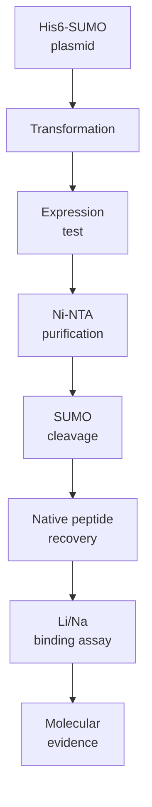

# Track A: Purified Peptide Validation

Track A answers the molecular-recognition question:

> Does the LiSPER peptide itself selectively recognize Li+ over Na+?

This track will use regenerated His6-SUMO-LiSPER plasmids for the final 8-candidate library to express soluble fusion proteins, cleave SUMO, recover native LiSPER peptides, and test Li+/Na+ binding directly.



## Contents

| Folder | Purpose |
|---|---|
| `plasmids/` | Final 8-candidate plasmid design workspace and vector records. |
| `protocols/` | Ordered Track A protocols from transformation through binding-data analysis. |

## Start Here

1. Read `protocols/00_track_A_protocol_overview.md`.
2. Use `protocols/README.md` as the ordered protocol index.
3. Read `protocols/construct_purification_alignment_check.md` before ordering or starting bench work.
4. Start with `LiA3-Ref` plus 2-4 priority candidates before scaling to the full final 8.

## Current Construct Readiness

The final 8 pET-28a(+)-His6-SUMO-LiSPER plasmid designs are vendor-ready in `plasmids/vendor_ready_restriction_SUMO/`.

Expected purification logic:

```text
His6-SUMO-LiSPER fusion
-> Ni-NTA capture
-> SUMO protease cleavage
-> second Ni-NTA subtraction
-> native LiSPER peptide in flow-through
```

The fusion proteins should be trackable by Tris-Tricine or high-percentage SDS-PAGE near 13.2-13.8 kDa. The released native peptides are only ~1.0-1.6 kDa, so routine SDS-PAGE may not be enough for peptide-level QC; MS/HPLC or assay-linked recovery evidence is recommended.
