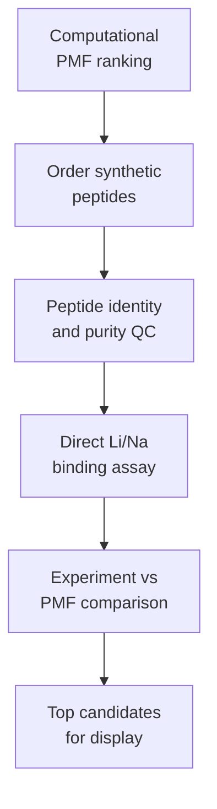

# Track A: Ordered Peptide Binding Validation

Track A answers the molecular-recognition question:

> Does the LiSPER peptide itself selectively recognize Li+ over Na+?

The current first-pass plan is to **order synthetic LiSPER peptides directly**, test Li+/Na+ binding, and compare the experimental ranking with computational PMF predictions.

The existing His6-SUMO plasmid and purification files are retained as a secondary/fallback route for future in-house peptide production, but they are no longer the first experimental gate.



## Contents

| Folder | Purpose |
|---|---|
| `planning/` | Current ordered synthetic peptide binding plan and computational-validation logic. |
| `plasmids/` | Secondary/fallback pET-28a(+)-His6-SUMO plasmid design workspace for optional in-house peptide production. |
| `protocols/` | Secondary/fallback expression, purification, cleavage, peptide-recovery, and binding-assay protocols. |

## Start Here

1. Read `planning/ordered_synthetic_peptide_binding_plan.md`.
2. Finalize which candidate peptides will be ordered.
3. Confirm peptide purity, counterion/salt form, solubility, and analytical method requirements with the vendor/core facility.
4. Run direct Li-only, Na-only, and Li+Na competition binding assays.
5. Compare experimental binding/selectivity ranking with PMF ranking.
6. Select top 2-3 candidates plus `LiA3-Ref` or another reference control for Track B surface display.

## Secondary Production Route

The final 8 pET-28a(+)-His6-SUMO-LiSPER plasmid designs remain vendor-ready in `plasmids/vendor_ready_restriction_SUMO/`.

Use this route only if ordered peptide supply, cost, modifications, or follow-up production needs justify in-house expression and purification.

Expected purification logic:

```text
His6-SUMO-LiSPER fusion
-> Ni-NTA capture
-> SUMO protease cleavage
-> second Ni-NTA subtraction
-> native LiSPER peptide in flow-through
```

The fusion proteins should be trackable by Tris-Tricine or high-percentage SDS-PAGE near 13.2-13.8 kDa. The released native peptides are only ~1.0-1.6 kDa, so routine SDS-PAGE may not be enough for peptide-level QC; MS/HPLC or assay-linked recovery evidence is recommended.
