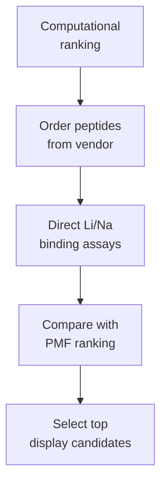

# Track A Planning

Track A begins with commercial synthetic LiSPER peptides (GenScript or equivalent China peptide vendor).

No plasmid design and no bacterial peptide production in this track.

| File | Purpose |
|---|---|
| [Ordered synthetic peptide binding plan](ordered_synthetic_peptide_binding_plan.md) | Main plan for vendor peptides validating computational Li/Na ranking |

Ordering details live in `../ordering/`.
