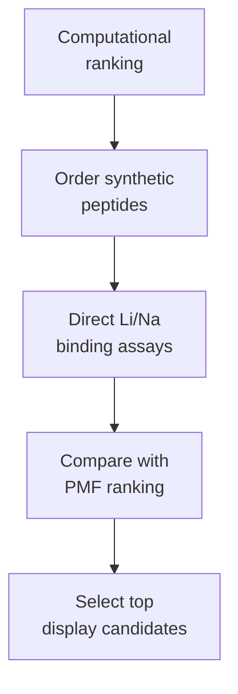

# Track A Planning

Track A now begins with ordered synthetic LiSPER peptides.

Use this folder to plan direct peptide binding assays before committing to surface-display plasmid construction.

| File | Purpose |
|---|---|
| [Ordered synthetic peptide binding plan](ordered_synthetic_peptide_binding_plan.md) | Main plan for using vendor-ordered peptides to validate computational Li/Na selectivity predictions |

## Current Logic

The His6-SUMO plasmid and purification materials remain available one level up as a fallback production route.
