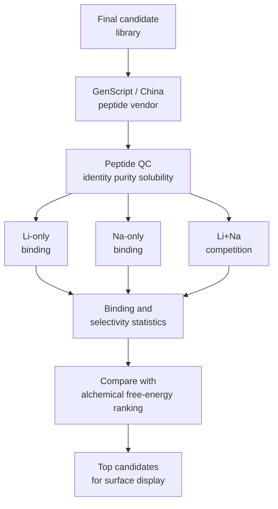

# Ordered Synthetic Peptide Binding Plan

Active Track A strategy:

> Buy synthetic LiSPER peptides from GenScript or another reliable China peptide vendor, run Li+/Na+ binding assays, validate computational ranking, then select Track B surface-display candidates.

No Track A plasmids. No bacterial culture or in-house peptide production.

## Purpose

Track A has two connected goals:

1. Test whether designed LiSPER peptides show measurable Li+/Na+ selectivity in solution.
2. Test whether computational ranking from MD/alchemical free-energy predicts experimental binding and selectivity trends.

This makes Track A both a molecular-recognition experiment and a validation test for the computational discovery pipeline.

## Study Flow



## Recommended Candidate Set

| Group | Role |
|---|---|
| Final LiSPER candidates | Experimental test set for computational predictions |
| `LiA3-Ref` or low-donor reference | Negative/reference peptide for weak Li-binding expectation |
| Optional published lithium-binding peptide | Positive reference if synthesis cost and assay design allow |

If budget allows, ordering all final candidates is best because it allows a true experimental-vs-computational rank comparison. If budget is limited, order the top computational subset plus the reference control.

## Vendor Information To Confirm

Use `../ordering/vendor_peptide_order_checklist.md` as the order checklist. Key fields:

| Item | Why it matters |
|---|---|
| Peptide purity | Low-purity material can distort binding data |
| Salt/counterion form | Sodium/TFA or other counterions can interfere with Li/Na assays |
| Terminal state | Acetylation/amidation or free termini can change charge and binding |
| Solubility guidance | Prevents failed assays from precipitation |
| Quantity | Must support repeats, controls, and follow-up assays |
| HPLC + MS certificate | Needed for publication-quality traceability |
| Exact sequence on vial | Must match `../ordering/candidate_order_table.csv` |

## Core Assays

| Assay | Purpose | Output |
|---|---|---|
| Li-only binding | Measures lithium interaction without sodium competition | Li uptake or binding signal |
| Na-only binding | Measures sodium background binding | Na uptake or binding signal |
| Li+Na competition | Tests selectivity under direct competition | Li/Na selectivity ratio |
| Blank/no-peptide control | Measures tube, buffer, and detection background | background correction |
| Reference peptide control | Anchors interpretation | weak/positive reference behavior |

## Preferred Quantification

| Method | Role |
|---|---|
| ICP-OES | Preferred routine Li/Na quantification if available |
| ICP-MS | Useful for lower concentrations or trace residual-metal tests |
| Ion chromatography | Good alternative if local method exists |
| Colorimetric/kit readout | Screening only; confirm hits by ICP if possible |

## Key Metrics

| Metric | Interpretation |
|---|---|
| Li binding signal | raw lithium affinity/capture behavior |
| Na binding signal | nonspecific sodium binding risk |
| Li/Na selectivity ratio | main experimental selectivity claim |
| Experimental rank | observed peptide performance order |
| Free-energy rank agreement | computational workflow reliability |
| Candidate advancement score | whether the peptide should enter Track B |

## Computational Validation Logic

The important question is not only:

```text
Does any peptide bind Li+?
```

The stronger question is:

```text
Do experimentally measured Li/Na trends agree with computational alchemical free-energy ranking?
```

A useful result can be:

- strong agreement between alchemical free-energy ranking and assay ranking,
- partial agreement with explainable outliers,
- failure of a specific design feature, which guides redesign.

## Track B Advancement Rule

Advance a peptide to surface display if:

- it shows Li binding above reference/background,
- Na binding is lower than Li binding under competition,
- the result is reproducible,
- peptide identity/purity is acceptable,
- the peptide is compatible with eCPX insertion/linker design.

Recommended Track B entry set:

```text
top 2-3 experimental peptide hits
LiA3-Ref or low-donor reference
empty eCPX scaffold
non-displaying host
optional positive LBP reference
```

## Output For Manuscript Or Report

The final Track A output should include:

| Candidate | free-energy prediction | Li binding | Na binding | Li/Na selectivity | Rank agreement | Track B decision |
|---|---:|---:|---:|---:|---|---|
| Candidate 1 | high | measured | measured | calculated | agree/disagree | advance/defer |
| Candidate 2 | medium | measured | measured | calculated | agree/disagree | advance/defer |
| `LiA3-Ref` | low | measured | measured | calculated | reference | control |

This table can support the claim that LiSPER's computational workflow is experimentally testable and useful for selecting wet-lab candidates.
