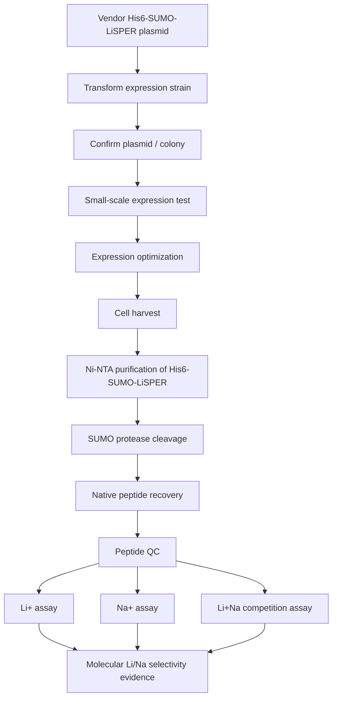

# Track A Protocol: Purified His6-SUMO-LiSPER Peptide Validation

## Purpose

Track A answers the molecular-recognition question:

> Does the LiSPER peptide itself selectively recognize Li+ over Na+?

This track is not an industrial deployment route. It is the direct molecular evidence needed to attribute lithium selectivity to the peptide sequence itself.

Starting point: vendor-delivered His6-SUMO-LiSPER plasmid.

Ending point: Li+/Na+ binding and selectivity data for purified or recovered LiSPER peptide.

## Plasmid-to-Purification Alignment

The current plasmid package is compatible with this purification track.

| Design element | Purification meaning |
|---|---|
| pET-28a(+) backbone | T7 expression in BL21(DE3) or another T7 expression strain; kanamycin selection. |
| N-terminal His6 tag | First capture step by Ni-NTA / IMAC. |
| Smt3 SUMO tag | Improves solubility and gives a SUMO protease cleavage site that releases the native peptide. |
| LiSPER peptide after SUMO C-terminal `GG` | SUMO cleavage should release the designed native peptide without extra residues. |
| Stop codon before XhoI | Prevents vector-derived C-terminal residues. |

Expected molecular sizes from the current 8-construct package:

| Candidate group | His6-SUMO-LiSPER fusion | Released peptide |
|---|---:|---:|
| 15 aa peptides | ~13.35-13.49 kDa | ~1.16-1.29 kDa |
| 19 aa peptides | ~13.77 kDa | ~1.58 kDa |
| 11 aa peptides | ~13.16-13.18 kDa | ~0.96-0.99 kDa |

The fusion protein should be visible on Tris-Tricine or high-percentage SDS-PAGE. The released peptide may not stain reliably, so peptide identity and recovery should rely on MS/HPLC when possible.

## Scientific Logic



## Required Controls

| Control | Purpose |
|---|---|
| Empty vector or His6-SUMO-only control | Measures tag, SUMO, resin, and buffer background. |
| LiA3-Ref LiSPER peptide | Sequence-related negative control. |
| No-peptide blank | Measures tube, buffer, and assay background. |
| Buffer-only blank | Detects Li/Na contamination. |
| Li-only condition | Measures Li binding without Na competition. |
| Na-only condition | Measures nonspecific Na binding. |
| Li+Na mixed condition | Direct selectivity test. |
| SUMO-cleavage reaction blank | Controls for protease, imidazole, SUMO, and cleavage-buffer carryover. |
| Known lithium-binding peptide, if available | Positive assay reference. |

## 1. Transformation

Why:

- Introduces vendor-delivered plasmids into an expression-compatible E. coli strain, likely BL21(DE3) for T7 expression.

Expected outcome:

- Kanamycin-resistant colonies carrying the His6-SUMO-LiSPER plasmid.

Workflow:

1. Thaw competent BL21(DE3) or equivalent T7 expression cells on ice.
2. Transform each vendor plasmid separately.
3. Recover in SOC or LB recovery medium.
4. Plate on LB-kanamycin.
5. Incubate overnight at 30-37 C.

Common failure modes:

| Failure | Likely cause | Solution |
|---|---|---|
| No colonies | Bad competent cells, wrong antibiotic, poor plasmid recovery | Include positive-control plasmid; verify kanamycin concentration; repeat with fresh competent cells. |
| Too many satellite colonies | Antibiotic too low or old plates | Use fresh kanamycin plates. |
| Slow growth | Toxic expression leakiness | Try lower temperature, glucose-containing medium, or tighter host if needed. |

## 2. Colony Selection

Why:

- Ensures the selected colony contains the expected plasmid before expression work.

Expected outcome:

- Confirmed colony or glycerol stock for each construct.

Workflow:

1. Pick 2-3 colonies per construct.
2. Grow small overnight cultures with kanamycin.
3. Confirm by colony PCR, restriction check, or vendor sequence record plus diagnostic PCR.
4. Make glycerol stocks of confirmed clones.

Failure modes and solutions:

- Weak PCR: optimize primer design or template amount.
- Mixed colonies: re-streak and re-test single colonies.
- Unexpected size: request/verify full plasmid sequence before continuing.

## 3. Expression Testing

Why:

- Determines whether the His6-SUMO-LiSPER fusion expresses detectably and whether it is soluble.

Expected outcome:

- Detectable fusion protein near the expected 13.2-13.8 kDa range.

Workflow:

1. Inoculate 3-5 mL starter cultures.
2. Dilute into small expression cultures.
3. Grow to mid-log phase.
4. Induce with a small IPTG matrix, such as 0, 0.05, 0.1, 0.5 mM.
5. Test temperatures: 16, 25, 30, and 37 C if feasible.
6. Harvest before and after induction.
7. Analyze total, soluble, and insoluble fractions by Tris-Tricine SDS-PAGE or high-percentage SDS-PAGE.

Failure modes:

| Failure | Meaning | Solution |
|---|---|---|
| No band | Low expression or wrong induction | Verify plasmid, host, antibiotic, IPTG, promoter compatibility. |
| Mostly insoluble | Inclusion bodies or aggregation | Lower temperature, lower IPTG, shorter/longer induction screen. |
| Band too small/large | Degradation or wrong construct | Western blot anti-His; sequence confirmation. |
| Peptide not visible after cleavage | Native peptide is too small and stains poorly | Use LC-MS/MALDI or targeted peptide detection. |

## 4. Expression Optimization

Why:

- Maximizes soluble fusion yield while keeping the workflow undergraduate-feasible.

Expected outcome:

- A reproducible condition for small- to mid-scale purification.

Suggested starting condition:

- BL21(DE3), LB or TB medium, kanamycin.
- Induce at OD600 0.5-0.8.
- IPTG 0.05-0.2 mM.
- 16-25 C overnight or 25-30 C for 4-8 h.

Optimization variables:

- IPTG concentration.
- Induction temperature.
- Induction time.
- Medium: LB vs TB.
- Culture scale.

Interpretation:

- Prefer slightly lower expression with higher solubility over high insoluble expression.

## 5. Cell Harvest

Why:

- Collects induced biomass for purification.

Expected outcome:

- Cell pellet containing soluble His6-SUMO-LiSPER fusion.

Workflow:

1. Pellet cells by centrifugation.
2. Record culture volume, OD600, and pellet mass.
3. Store pellet at -80 C or proceed immediately.

Failure modes:

- Low biomass: optimize growth/induction.
- Pellet not labeled well: use rigorous sample naming by candidate and condition.

## 6. Ni-NTA Purification

Why:

- His6 tag enables affinity capture of His6-SUMO-LiSPER fusion.

Expected outcome:

- Enriched His6-SUMO-LiSPER fusion with reduced host-cell proteins.

Suggested buffer logic:

- Use standard Ni-NTA buffers for expression/purification, but remove imidazole/nickel before ion-binding assays.
- Avoid using purified protein directly in Li/Na assays without desalting/buffer exchange.

Workflow:

1. Lyse cell pellet in Ni-NTA lysis buffer.
2. Clarify lysate by centrifugation.
3. Bind soluble fraction to Ni-NTA resin.
4. Wash with low-to-moderate imidazole.
5. Elute His6-SUMO-LiSPER with imidazole.
6. Analyze fractions by gel.

Failure modes:

| Failure | Likely cause | Solution |
|---|---|---|
| Fusion in flow-through | His tag inaccessible or resin overloaded | Reduce load, batch bind longer, check pH. |
| Many contaminants | Wash too weak | Increase imidazole in wash. |
| Low recovery | Insolubility or degradation | Revisit expression/lysis conditions. |
| Nickel/imidazole carryover | Inadequate buffer exchange | Desalt before cleavage and assays. |

## 7. SUMO Cleavage

Why:

- Releases native LiSPER peptide without extra His tag or vector-derived residues.

Expected outcome:

- His6-SUMO and untagged native LiSPER peptide after SUMO protease digestion.

Workflow:

1. Buffer exchange purified fusion into SUMO-protease-compatible buffer.
2. Add SUMO protease.
3. Incubate under recommended conditions.
4. Monitor cleavage by gel for disappearance/shift of fusion band.
5. Run post-cleavage mixture over Ni-NTA again:
   - His6-SUMO and His-tagged protease bind resin.
   - untagged LiSPER peptide should be in flow-through.

Failure modes:

| Failure | Cause | Solution |
|---|---|---|
| Incomplete cleavage | Wrong buffer, too little protease, inaccessible site | Optimize protease ratio, time, temperature, buffer. |
| Peptide lost during cleanup | Peptide too small for filters/resins | Avoid MWCO devices that retain/discard incorrectly; collect all flow-through fractions. |
| Peptide sticks to tubes/resin | Hydrophobic/electrostatic loss | Test low-bind tubes, salt/pH conditions, rapid processing. |

## 8. Peptide Recovery

Why:

- Isolates native LiSPER peptide for molecular binding assays.

Expected outcome:

- Low-molecular-weight peptide-containing fraction suitable for QC and binding tests.

Important practical point:

- Native LiSPER peptides are only ~1-2 kDa. Many standard centrifugal filters will not retain them. Recovery strategy must be designed around low molecular weight.

Options:

- Collect Ni-NTA post-cleavage flow-through.
- Desalt by C18 SPE or HPLC if available.
- Use lyophilization if compatible.
- Use LC-MS/MALDI confirmation rather than relying only on gel visualization.

Failure modes:

- No detectable peptide: use mass spectrometry rather than gel alone.
- Low yield: optimize cleavage cleanup and reduce handling steps.
- Contamination from SUMO/protease: improve second Ni-NTA cleanup.

## 9. Peptide Quality Control

Why:

- Binding data are interpretable only if the peptide identity, approximate purity, and buffer composition are known.

Recommended QC:

| QC | Purpose |
|---|---|
| LC-MS or MALDI-TOF | Confirms peptide mass. |
| Analytical HPLC, if available | Estimates purity. |
| Tris-Tricine SDS-PAGE | Tracks fusion/SUMO/protease, but may not show free peptide well. |
| Conductivity or desalting check | Confirms removal of imidazole/salts before binding assays. |
| ICP blank of peptide buffer | Detects Li/Na contamination. |

## 10. Storage and Stability

Why:

- Small acidic/flexible peptides may degrade, adsorb to plastic, or change concentration during storage.

Recommended approach:

- Store short-term at 4 C only during active handling.
- Store longer-term at -80 C in aliquots.
- Avoid repeated freeze-thaw cycles.
- Consider lyophilized aliquots after desalting.
- Track peptide concentration by dry mass, amino-acid analysis, HPLC, or other available method; A280 is likely poor because LiSPER peptides lack aromatic residues.

Failure modes:

- Apparent loss over time: adsorption to tubes or degradation.
- Variable assay results: freeze-thaw or concentration uncertainty.

## 11. Li+ Binding Assay

Why:

- Tests whether purified LiSPER peptide binds Li+ in the absence of Na competition.

Suggested assay:

1. Prepare low-sodium buffer: HEPES/PIPES-KOH, pH 7.0-7.5.
2. Prepare LiCl concentration series: 0.1, 0.5, 1, 5, 10 mM.
3. Incubate known peptide amount with Li+.
4. Separate bound/free using a method appropriate to the assay format:
   - dialysis/equilibrium dialysis,
   - ultrafiltration only if peptide retention is validated,
   - immobilized peptide/bead format if solution separation is too difficult,
   - outsourced ICP on pre/post samples if practical.
5. Measure Li by ICP-OES/ICP-MS or validated kit in early screens.

Interpretation:

- Li signal must exceed no-peptide, SUMO-only, and LiA3-Ref background.

## 12. Na+ Binding Assay

Why:

- Tests nonspecific sodium association.

Workflow:

- Match the Li assay format, replacing LiCl with NaCl.
- Use Na concentrations relevant to competition: 1, 10, 100, 500 mM.

Interpretation:

- A good LiSPER peptide should show low Na association relative to Li under comparable conditions.

## 13. Li+/Na+ Competition Assay

Why:

- Directly tests selectivity under competition.

Suggested conditions:

- 1 mM Li + 1 mM Na.
- 1 mM Li + 10 mM Na.
- 1 mM Li + 100 mM Na.
- 10 mM Li + 100 mM Na for higher-signal tests.

Readout:

- Quantify Li and Na in free and bound/recovered fractions.

Interpretation:

- A strong candidate enriches Li relative to the starting Li/Na solution ratio and outperforms LiA3-Ref.

## 14. Data Analysis

Core metrics:

```text
Li_bound = Li_initial - Li_free
Na_bound = Na_initial - Na_free
Li_percent_bound = 100 * Li_bound / Li_initial
Na_percent_bound = 100 * Na_bound / Na_initial
Li_Na_selectivity = (Li_bound / Na_bound) / (Li_initial / Na_initial)
```

Normalize by:

- peptide amount,
- assay volume,
- candidate,
- control background,
- measurement batch.

## 15. Interpretation Criteria

Strong Track A evidence:

- purified/recovered peptide identity confirmed,
- Li binding above no-peptide and LiA3-Ref controls,
- Na binding low relative to Li,
- mixed Li+Na assay shows Li enrichment,
- results reproducible across independent preparations.

What Track A proves:

- LiSPER peptide sequence can drive molecular Li recognition/selectivity.

What Track A does not prove:

- peptide works on a cell surface,
- peptide works in a packed bed,
- peptide survives industrial raffinate,
- peptide can be produced economically at scale.

## 16. Troubleshooting Summary

| Problem | Likely cause | Practical solution |
|---|---|---|
| Low fusion expression | Toxicity, poor induction | Lower IPTG/temp; test time course. |
| Insoluble fusion | Aggregation | Lower induction temp; shorter induction; soluble fraction screen. |
| Poor Ni-NTA recovery | Tag inaccessible or overloaded resin | Batch bind longer; reduce load; verify pH. |
| Incomplete SUMO cleavage | Buffer/protease issue | Optimize ratio/time/temp; buffer exchange. |
| Peptide disappears | Small peptide loss | Avoid inappropriate filters; collect flow-through; use low-bind tubes. |
| No Li signal | Assay sensitivity or true no binding | Increase peptide/Li; verify analytical method; compare controls. |
| High Na signal | Nonspecific binding or salt contamination | Improve buffer purity; include blanks; reduce charged contaminants. |
| Poor mass balance | Precipitation, adsorption, sample prep error | Include tube blanks, digest pellets, validate separation. |

## DKU Undergraduate Feasibility Notes

Start with a small subset:

1. LiA3-Ref.
2. LiD3-Core.
3. LiND-Hybrid.
4. LiD3-Flex.
5. LiLC-1.

Recommended staged plan:

1. Confirm expression of His6-SUMO fusions.
2. Purify one positive-priority candidate and LiA3-Ref.
3. Demonstrate SUMO cleavage and peptide recovery.
4. Run a simple Li-only and Na-only assay.
5. Move to mixed Li+Na and ICP validation only after recovery/QC is reliable.
