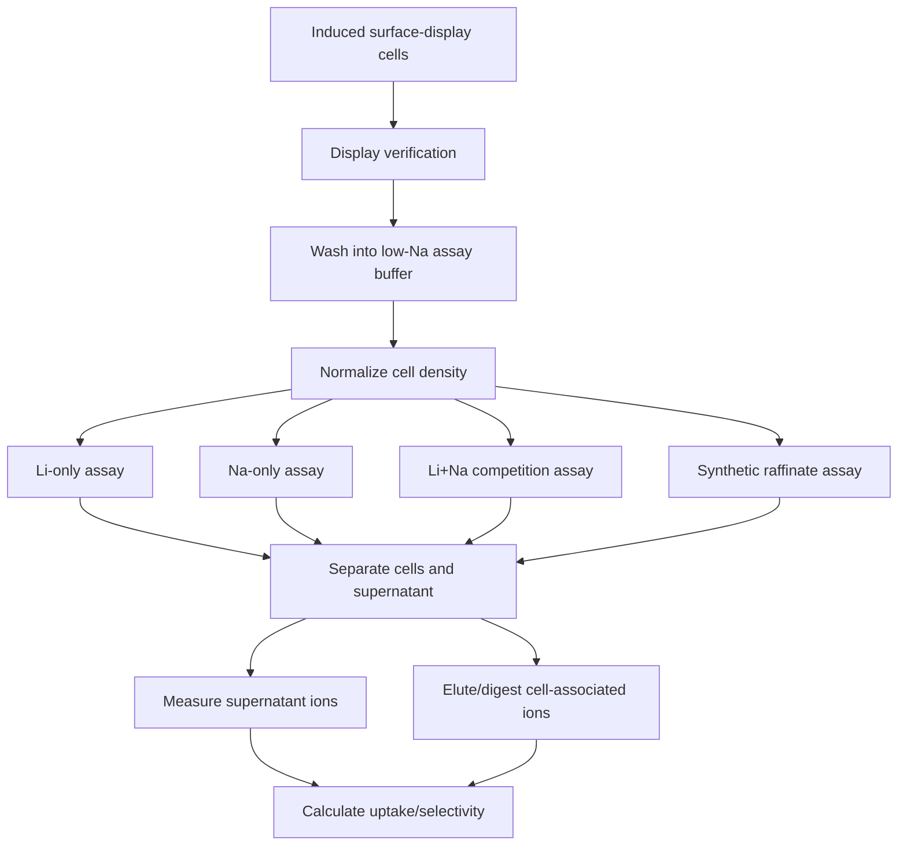

# LiSPER Whole-Cell Li+/Na+ Binding and Selectivity Assay Plan

Repository note: the originally requested deliverable path was `wetlab/surface_display_assays/`. In the current LiSPER repository, the equivalent active location is `02_experimental_validation/track_B_surface_display/assays/surface_display_assays/`.

## Goal

Design the downstream assay before designing eCPX plasmids. The assay should test whether E. coli K-12/MG1655-compatible cells displaying LiSPER peptides on the surface can selectively capture Li+ from aqueous solution while rejecting Na+.

The updated wet-lab logic is:

```text
ordered synthetic peptide binding assay
↓
experimental Li/Na ranking and PMF comparison
↓
top 2-3 candidates plus controls
↓
surface-display assay and optimization
```

Therefore this plan treats surface display as the main engineering follow-up after direct peptide binding statistics, not as a replacement for peptide-intrinsic validation.

## Core Recommendation

Use both live and non-living cell formats, but do not rely on live cells alone.

| Cell format | Recommended role | Rationale |
|---|---|---|
| Live induced cells | First biological display test | Tests true whole-cell display under mild conditions. |
| Chemically fixed cells | Main comparability format after optimization | Reduces metabolism, leakage, growth, and time-dependent physiological variation while preserving surface proteins if fixation is mild. |
| Heat-inactivated cells | Stress/robustness control only | Heat may denature eCPX or LiSPER peptides and create misleading loss of binding. |
| Non-displaying/killed controls | Required background controls | Distinguishes LiSPER binding from cell envelope, scaffold, and dead-biomass adsorption. |

Initial experiments should compare live cells and mildly fixed cells side-by-side. If fixed cells preserve display and binding, fixed-cell assays should become the preferred quantitative validation format because they are easier to standardize.

## Buffer Selection

Avoid sodium-containing buffers for Li/Na assays.

Recommended loading buffer:

- 10-25 mM HEPES or PIPES, adjusted with KOH or trace-metal-clean HCl/KOH, pH 7.0-7.5.
- 50-150 mM KCl if osmotic support is needed.
- No NaCl unless deliberately testing sodium competition.
- No EDTA, citrate, phosphate, Tris base contaminated with metals, or chelators in binding reactions unless used as specific controls.
- Use ultrapure water and acid-washed or certified low-metal plasticware when preparing ICP samples.

Why HEPES/PIPES:

- Low sodium background if prepared from free acid and adjusted with KOH.
- Better biological compatibility than pure water.
- Less direct metal chelation than citrate/EDTA.
- Avoids phosphate precipitation/interference with residual metals.

## Overall Assay Logic



## Surface Expression Verification

Display verification should happen before binding assays because ion uptake cannot be interpreted without knowing whether the peptide reached the surface.

| Method | Recommended use | Notes |
|---|---|---|
| Epitope tag staining + flow cytometry | Primary display QC | Quantifies population-level display and detects heterogeneity. |
| Immunofluorescence microscopy | Secondary visual QC | Confirms surface-localized signal and gross morphology. |
| Protease accessibility assay | Topology confirmation | Surface-exposed tags should be degraded by externally added protease; intracellular controls should not. |
| Western blot/dot blot | Expression confirmation | Useful but cannot alone prove surface exposure. |

Detection tag guidance:

- Include a small epitope tag for display verification, but place it so it does not overlap the LiSPER binding motif.
- A C-terminal or N-terminal tag relative to the displayed loop must be chosen based on eCPX topology.
- Use a flexible Gly/Ser linker between LiSPER and tag if the tag is displayed near the peptide.
- Include tag-only and scaffold-only controls because tags can contribute nonspecific ion adsorption.

## Controls

Required controls:

| Control | Purpose |
|---|---|
| No-cell blank | Detects tube, filter, and buffer ion background. |
| Buffer-only blank | Baseline Li/Na concentration and contamination check. |
| Non-displaying E. coli | Measures native cell-envelope adsorption. |
| Empty eCPX scaffold | Measures display-scaffold background. |
| eCPX + LiA3-Ref peptide | Controls for peptide length/composition without expected Li-binding motif. |
| Known lithium-binding peptide, if available | Positive reference for assay sensitivity. |
| Killed-cell control | Distinguishes living-cell effects from passive surface adsorption. |
| Li-only condition | Measures lithium uptake without sodium competition. |
| Na-only condition | Measures sodium adsorption background. |
| Li+Na mixed competition condition | Main selectivity test. |
| Residual-metal competition condition | Tests robustness against Ni2+, Co2+, Mn2+, Fe3+, Al3+, and Cu2+. |

## Suggested Experimental Ranges

| Parameter | Level 1 screening | Level 2 quantitative validation | Level 3 synthetic raffinate |
|---|---:|---:|---:|
| Li+ | 0.1-10 mM | 0.1-50 mM | 10-150 mM |
| Na+ | 0-100 mM | 1-500 mM | 100-1000 mM |
| Li:Na molar ratio | 1:0, 1:1, 1:10 | 1:1, 1:10, 1:100 | 1:10 to 1:100 |
| pH | 7.0-7.5 | 6.5, 7.0, 7.5, 8.0 | 6.5-8.5 |
| Temperature | 25-30 C | 25, 30, 37 C | 25-40 C |
| Incubation time | 15-60 min | 5, 15, 30, 60, 120 min | 30-180 min |
| Cell density | OD600 1-5 equivalent | OD600 1, 2, 5 equivalent | OD600 2-10 equivalent |
| Biological replicates | 3 | 3-5 | 3 |
| Technical replicates | 2-3 | 2-3 | 2 |

Use OD600-equivalent normalization for early work and dry cell weight normalization for publishable capacity data. If display level is measured by flow cytometry, also normalize by display signal.

## Level 1: Low-Cost Screening Assay

Goal: rapidly compare candidates and eliminate obvious non-binders or high-Na binders.

### Workflow

1. Cell preparation:
   - Grow and induce candidate, empty-scaffold, non-display, and LiA3-Ref strains using the future optimized eCPX expression condition.
   - Harvest cells gently and wash repeatedly into low-Na HEPES/KCl buffer.
   - Normalize by OD600 equivalent.
2. Display verification:
   - Use epitope tag staining on a subset by flow cytometry or microscopy.
3. Binding incubation:
   - Incubate normalized cells with Li-only, Na-only, and Li+Na mixed solutions.
   - Suggested first screen: 1 mM LiCl, 10 mM NaCl, pH 7.2, 30 min, OD600 equivalent 2.
4. Separation:
   - Centrifuge cells in low-bind tubes.
   - Collect supernatant carefully without disturbing pellet.
   - Optional: repeat with 0.22 um spin filtration to test separation artifacts.
5. Wash:
   - Wash pellet once with cold low-Na buffer without Li/Na to remove loosely retained solution.
6. Elution/release:
   - For low-cost screen, prioritize supernatant depletion first.
   - Optional pellet release: mild acid extraction or nitric-acid digestion for outsourced analysis.
7. Measurement:
   - Commercial Li+ and Na+ assay kits if concentration range is compatible.
   - Conductivity as a nonspecific sanity check only, not a selectivity readout.
   - Outsourced ICP-OES small sample batch is preferred if local kit sensitivity is inadequate.
8. Data analysis:
   - Compare percent Li removal and percent Na removal against empty scaffold and LiA3-Ref.
   - Flag candidates with Li uptake above controls and low Na uptake.

### Interpretation

A candidate advances if it shows reproducibly higher Li depletion than empty scaffold and LiA3-Ref while showing minimal Na depletion in mixed Li+Na solution.

## Level 2: Quantitative Validation Assay

Goal: generate publishable binding/selectivity data.

Preferred readout: ICP-OES or ICP-MS for Li and Na quantification.

ICP-OES is likely sufficient for mM to high-uM Li/Na assays and is usually more affordable. ICP-MS is more sensitive but more expensive and more prone to matrix issues; use it for low-concentration assays or trace residual metals.

### Workflow

1. Cell preparation:
   - Prepare biological triplicates or quintuplicates from independent cultures.
   - Compare live and chemically fixed cells in the same experiment.
   - Normalize by OD600 and separately determine dry cell weight conversion.
2. Induction/display:
   - Use the future eCPX induction condition that maximizes surface signal without major growth defects.
   - Verify display by flow cytometry for every biological replicate.
3. Washing:
   - Wash 3-5 times into low-Na assay buffer.
   - Measure the final wash for Li/Na background in pilot runs.
4. Binding incubation:
   - Test Li-only, Na-only, and mixed Li+Na competition.
   - Suggested validation matrix:
     - Li-only: 0.5, 1, 5, 10 mM LiCl.
     - Na-only: 5, 10, 50, 100 mM NaCl.
     - Mixed: 1 mM Li + 10, 100, or 500 mM Na.
   - Time points: 5, 15, 30, 60, 120 min.
5. Separation:
   - Centrifugation is primary because it is cheap and scalable.
   - Validate a subset by filtration to check pellet carryover or resuspension artifacts.
6. Wash:
   - Wash pellets once or twice with Li/Na-free assay buffer.
   - Keep wash fractions for ICP in method-development runs.
7. Elution/release:
   - Measure both supernatant depletion and cell-associated ion release.
   - Release options:
     - mild acid elution to test reversible binding,
     - nitric-acid digestion to quantify total cell-associated Li/Na.
   - For publication, total digestion is the stronger mass-balance method.
8. ICP sample preparation:
   - Filter or clarify supernatants.
   - Acidify ICP samples with trace-metal-grade nitric acid according to the analytical facility's requirements.
   - Prepare standards in matrix-matched buffer/acid where possible.
   - Include blank buffer, no-cell blank, and digest blanks.
9. Data analysis:
   - Calculate uptake from depletion and from pellet release/digestion.
   - Check mass balance: initial ion approximately equals supernatant + wash + pellet-associated ion.
   - Normalize by OD600, dry cell weight, and display level if available.

### Interpretation

Publishable evidence requires:

- candidate Li uptake above empty scaffold and LiA3-Ref,
- low Na uptake under Na-only and mixed conditions,
- Li/Na selectivity ratio above controls,
- reproducibility across independent biological replicates,
- no major loss of display or cell integrity during assay.

## Level 3: Application-Like Synthetic Raffinate Assay

Goal: test whether surface-displayed LiSPER still works in a simplified battery-recycling-like matrix.

This level should only follow Level 1 and Level 2 success.

### Suggested Synthetic Raffinate Matrix

Start simple, then add complexity:

| Matrix | Composition |
|---|---|
| Raffinate A | 10 mM Li+, 100 mM Na+, pH 7.2 |
| Raffinate B | 50 mM Li+, 500 mM Na+, pH 7.2 |
| Raffinate C | 10-50 mM Li+, 100-500 mM Na+, plus low residual Ni2+/Co2+/Mn2+ |
| Raffinate D | Raffinate C plus trace Fe3+/Al3+/Cu2+ |

Residual metal starting points for screening:

- Ni2+, Co2+, Mn2+: 1-10 mg/L each.
- Fe3+, Al3+, Cu2+: 0.1-5 mg/L each.

These values are not universal industrial constants; they are challenge conditions to test whether multivalent metals dominate peptide binding.

### Workflow

1. Cell preparation:
   - Use best candidate(s), empty scaffold, LiA3-Ref, and non-displaying cells.
   - Prefer fixed cells if Level 2 shows fixation preserves binding.
2. Display verification:
   - Confirm display before and after exposure for at least representative samples.
3. Washing:
   - Use low-Na buffer, then pre-equilibrate cells into raffinate pH/ionic strength if needed.
4. Binding incubation:
   - 30, 60, and 180 min.
   - 25, 30, and 37 C initially; 40 C only if cells/display remain stable.
5. Separation:
   - Centrifugation for standard assays.
   - Filtration for turbid or metal-precipitating matrices.
6. Wash:
   - Use a controlled wash matching the non-Li background as much as possible, but without Li.
7. Elution/release:
   - Mild acid elution for reversible capture.
   - Nitric-acid digestion for mass balance.
8. Measurement:
   - ICP-OES or ICP-MS for Li, Na, and residual metals.
9. Data analysis:
   - Calculate Li uptake, Na uptake, residual metal uptake, Li/Na selectivity, and Li/residual-metal competition.

### Interpretation

A candidate remains promising if it preserves Li selectivity under high sodium and does not become dominated by Ni/Co/Mn/Cu/Fe/Al uptake.

## Separation Method Recommendation

| Method | Recommendation | Rationale |
|---|---|---|
| Centrifugation | Primary method | Cheap, accessible, compatible with E. coli cells and many sample volumes. |
| Spin filtration | Secondary validation | Helps verify that pellet carryover is not biasing supernatant results. |
| Vacuum/plate filtration | Useful for higher throughput | Requires low-metal filters and adsorption controls. |
| Magnetic capture | Later only | Relevant if cells are immobilized or magnetic supports are introduced. |

Always run no-cell tube/filter blanks because Li+ adsorption to plastics is usually low but cannot be assumed.

## Analytical Method Recommendation

| Method | Best role | Limitations |
|---|---|---|
| ICP-OES | Main validation and publication method | Requires facility access and acidified samples; less sensitive than ICP-MS. |
| ICP-MS | Trace-level or multi-metal validation | Higher cost and matrix sensitivity. |
| Flame photometry | Possible sodium/lithium screen | Limited multi-element capability and sensitivity. |
| Ion chromatography | Useful if available | Requires method development for Li/Na and high-salt matrices. |
| Lithium colorimetric kit | Level 1 screening | Matrix interference and limited dynamic range. |
| Sodium colorimetric kit | Level 1 screening/control | High Na samples may need large dilutions. |
| Outsourced ICP | Most realistic if DKU lacks in-house instrument access | Requires careful sample prep, labeling, and batch design. |

Most realistic DKU/Kunshan path:

1. Use low-cost kits or outsourced small ICP batches for pilot screening.
2. Use DKU/shared-instrument ICP-OES or outsourced ICP-OES for Level 2.
3. Use ICP-MS only for low-level residual metal competition or if Li concentrations are below ICP-OES comfort range.

## Data Interpretation Criteria

A good LiSPER candidate should show:

- higher Li+ depletion from solution than controls,
- higher pellet-associated Li+ than controls,
- low Na+ depletion and low pellet-associated Na+,
- higher Li/Na enrichment than empty scaffold and LiA3-Ref,
- reproducible performance across biological replicates,
- retained function after washing/elution if regeneration is tested,
- surface display level sufficient to explain binding signal.

Failure modes:

- high Li and high Na uptake: nonspecific polyanion/cell-envelope adsorption.
- high metal uptake in raffinate: multivalent-metal binding dominates Li selectivity.
- strong supernatant depletion but weak pellet recovery: precipitation, tube loss, or separation artifact.
- good binding only in live cells: possible active transport/metabolic artifact rather than surface capture.
- good display but no Li selectivity: peptide not functional in eCPX context or tag/linker interferes.
