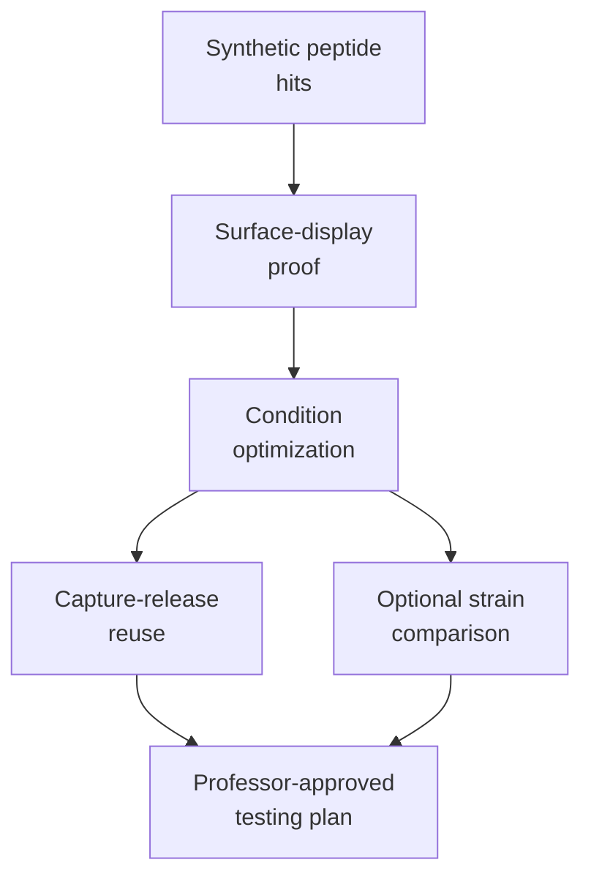

# Track B Planning

This folder translates the surface-display idea into a decision-ready experimental plan.

Use these files before designing eCPX plasmids or committing to a full testing matrix.

| File | Purpose |
|---|---|
| [Integrated surface-display optimization plan](integrated_surface_display_optimization_plan.md) | Main Track B plan: how to combine proof-of-display, condition optimization, regeneration, and optional strain comparison |
| [Decision priority matrix](decision_priority_matrix.md) | Which modules to do first, which to defer, and what each module proves |
| [Professor discussion brief](professor_discussion_brief.md) | Short professor-facing summary and decision questions for meeting/report preparation |

## Planning Logic

## Relationship To Other Track B Files

| Folder | Role |
|---|---|
| `../assays/surface_display_assays/` | Detailed assay design package |
| `../protocols/` | Surface-display workflow protocol overview |
| `../plasmids/` | Placeholder for future eCPX plasmid designs |
| `../research/surface_display_host_selection/` | Host and display-platform evidence base |

Keep this folder focused on study design, prioritization, and decision-making.
