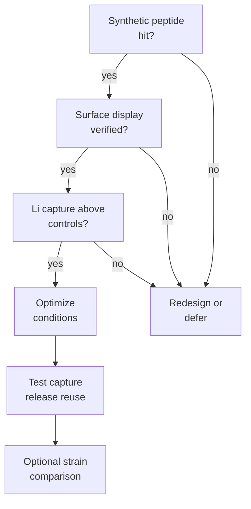

# Track B Decision Priority Matrix

This document ranks the possible Track B modules by importance for the goal:

> Find the best bacterial surface-display condition for lithium capture, release, and recycling.

## Module Ranking

| Priority | Module | Essential question | Recommendation |
|---:|---|---|---|
| 0 | Synthetic peptide pre-screen | Which LiSPER candidates are worth displaying? | Required before plasmid investment |
| 1 | Surface-display proof | Does the displayed peptide reach the surface and capture Li? | Required |
| 2 | Condition optimization | Under what pH, salt, temperature, time, and cell format does capture work best? | Required for the project goal |
| 3 | Capture-release-reuse | Can the material release Li and retain function across cycles? | Strongly recommended |
| 4 | Strain comparison | Which host gives the best display/capture robustness? | Optional after the assay works |

## If Time Is Limited

| Available time | Do first | Defer |
|---|---|---|
| 4-6 weeks | Display proof with one host and top 1-2 candidates | broad condition matrix, strain comparison |
| 6-8 weeks | Display proof plus small condition matrix | regeneration cycles if signal is weak |
| 8-12 weeks | Display proof, condition optimization, and first regeneration test | broad strain comparison |
| More than 12 weeks | Add one strain comparator or a more realistic raffinate matrix | large multi-host, multi-peptide expansion |

## Decision Tree



## Variables To Avoid Combining Too Early

Do not start with all combinations of:

- all peptides,
- all hosts,
- all display scaffolds,
- all pH values,
- all temperatures,
- all salt levels,
- all live/fixed formats.

That design becomes too large and hard to interpret.

Use this order instead:

```text
best peptide candidates
one host
one display platform
one simple assay
then optimize conditions
then test reuse
then compare hosts if needed
```

## Recommended First Dataset

| Group | Constructs | Purpose |
|---|---|---|
| Background | non-displaying host | cell-envelope adsorption |
| Scaffold control | empty eCPX | scaffold/tag adsorption |
| Peptide reference | `LiA3-Ref` or low-donor reference | weak-binding peptide context |
| Test candidates | top 2-3 synthetic peptide hits | LiSPER performance |
| Optional positive reference | known LBP display | assay sensitivity reference |

## Recommended Metrics

| Metric | Priority | Reason |
|---|---:|---|
| Display signal | Required | Binding cannot be interpreted without display evidence |
| Li uptake per cell-density unit | Required | basic capture performance |
| Na uptake per cell-density unit | Required | selectivity background |
| Li/Na selectivity ratio | Required | core claim |
| Li uptake per display signal | High | separates true peptide performance from expression level |
| Capacity retained after reuse | High | supports cost and recycling argument |
| Strain-to-strain comparison | Optional | useful only after the base assay works |
