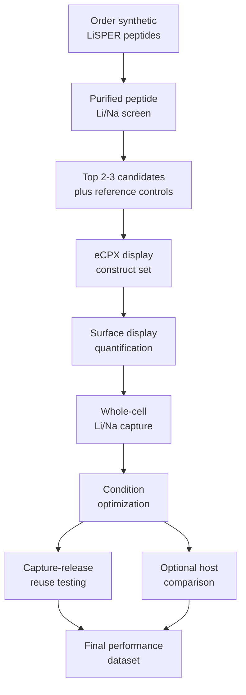

# Integrated Surface-Display Optimization Plan

This plan reframes Track B as an engineering study:

> Can LiSPER-displaying bacteria become a low-cost, reusable, and selective lithium-capture material?

The updated strategy is to order synthetic LiSPER peptides first, rank their intrinsic Li+/Na+ binding behavior, and only then build surface-display constructs for the strongest candidates.

## Study Logic



## Central Hypothesis

Displayed LiSPER peptides can retain lithium-selective binding on bacterial surfaces, and the resulting cells can act as reusable capture materials if display level, buffer condition, cell format, and regeneration conditions are optimized.

## Minimal Experimental System

| Component | Recommended first choice | Reason |
|---|---|---|
| Host | `E. coli` K-12 / MG1655-compatible strain | Lowest-risk academic chassis for eCPX/OmpX-style display |
| Display platform | eCPX | Best first-line small-peptide display system in the current review |
| Candidate set | Top 2-3 synthetic peptide hits | Avoids building display constructs for weak candidates |
| Negative peptide control | `LiA3-Ref` or current low-donor reference | Controls peptide length/composition without expected strong Li binding |
| Scaffold control | Empty eCPX with same tag/linker context | Measures scaffold and tag background |
| Cell background control | Non-displaying host | Measures native cell-envelope adsorption |
| Positive reference | Published lithium-binding peptide, if feasible | Confirms the assay can detect lithium-binding behavior |

## What To Measure

| Measurement | Primary output | Why it matters |
|---|---|---|
| Surface-display level | Display-positive fraction and display signal | Confirms construct expression and surface presentation |
| Growth burden | Growth/viability proxy relative to controls | Identifies toxic or unstable display constructs |
| Li uptake | Li captured per biomass or cell-density unit | Core capture performance |
| Na uptake | Na captured per biomass or cell-density unit | Selectivity background |
| Li/Na selectivity | Li enrichment relative to Na | Core LiSPER claim |
| Display-normalized capture | Li uptake per display signal | Separates peptide efficiency from expression level |
| Live/fixed comparison | Retained capture after nonliving preparation | Supports future reusable biosorbent logic |
| Regeneration | Capture retained over cycles | Supports lithium recycling and cost reduction |

## Quantification Options

| Question | Strongest method | Lower-cost or supporting method | Notes |
|---|---|---|---|
| Is the peptide displayed? | Flow cytometry after epitope staining | Plate-reader fluorescence after staining | Flow cytometry gives single-cell heterogeneity; plate reader is easier if FACS is unavailable |
| Is the peptide surface-accessible? | Protease accessibility plus flow/Western readout | Immunofluorescence microscopy | Accessibility is important before interpreting Li uptake |
| How much Li/Na is captured? | ICP-OES or ICP-MS | Ion chromatography or validated colorimetric screen | ICP is preferred for publishable Li/Na data |
| Is capture passive or metabolism-related? | Live versus mildly fixed comparison | Killed-cell stress controls | Fixed cells are attractive if binding is retained |
| Can cells be reused? | Capture-elution-regeneration cycles with ICP | Small-cycle screen followed by ICP confirmation | This is the key cost/recycling module |

## Module A: Surface-Display Proof

Purpose:

- Prove that the selected LiSPER candidates can be displayed and remain measurable on the cell surface.

Minimal output:

- display signal above non-displaying and empty-scaffold controls,
- acceptable growth burden,
- first Li/Na capture signal above controls.

What this module proves:

- Track B is technically viable.
- Li uptake is not being interpreted without display evidence.

What this module does not prove:

- best industrial operating condition,
- reusability,
- best host strain.

## Module C: Condition Optimization

Purpose:

- Identify the best operating window for LiSPER-displaying cells as a lithium-capture material.

Suggested variables to optimize after Module A works:

| Variable | First-pass comparison |
|---|---|
| pH | near-neutral range first, then expand only if signal is robust |
| Temperature | room temperature versus mild incubation temperature |
| Incubation time | short, medium, and longer contact times |
| Na competition | low, medium, and high Na excess |
| Cell loading | low, medium, and high cell-density equivalents |
| Cell format | live versus fixed cells |

Main output:

- best condition for Li capture,
- best condition for Li/Na selectivity,
- tradeoff between capacity and selectivity.

Important note:

- Do not optimize all variables at once. Start with one best candidate and one reference control, then expand.

## Module D: Capture-Release-Reuse

Purpose:

- Test whether LiSPER-displaying cells can support a practical recycling cycle.

Conceptual workflow:

```text
capture Li+
wash
elute Li+
regenerate or re-equilibrate cells
repeat capture
```

Measurements per cycle:

| Measurement | Interpretation |
|---|---|
| Li captured | capture capacity |
| Na co-captured | selectivity loss or nonspecific adsorption |
| Li released | recovery efficiency |
| display signal retained | surface-display stability |
| capacity retained | material reusability |

Main output:

- percent capacity retained after repeated cycles,
- Li recovery efficiency,
- whether displayed cells can be considered reusable biosorbents.

## Module B: Optional Strain Comparison

Purpose:

- Test whether host chassis changes display level, robustness, or lithium-capture performance.

Recommended order:

| Priority | Host | Reason |
|---:|---|---|
| 1 | `E. coli` K-12 / MG1655-compatible strain | first proof-of-concept chassis |
| 2 | `E. coli` BL21(DE3) | possible expression/display improvement |
| 3 | `Bacillus subtilis` | later robust or spore-display direction |
| 4 | `Pseudomonas putida` | later stress-tolerant chassis |
| 5 | Halophilic chassis | future high-salt industrial research |

Recommendation:

- Do not begin with broad strain comparison.
- Only compare strains after one peptide, one display scaffold, and one assay condition are already working.

## Recommended Priority Order

| Priority | Module | Decision |
|---:|---|---|
| 0 | Synthetic peptide screen | Required before Track B construct selection |
| 1 | Module A: surface-display proof | Required |
| 2 | Module C: condition optimization | Required for the project purpose |
| 3 | Module D: capture-release-reuse | Strongly recommended for recycling/cost argument |
| 4 | Module B: strain comparison | Optional if time and resources remain |

## Two-To-Three-Month Working Plan

This timeline assumes synthetic peptide ranking has already identified candidates or is happening in parallel.

| Time window | Main task | Output |
|---|---|---|
| Weeks 1-2 | Finalize professor-approved Track B design | candidate list, controls, measurement methods |
| Weeks 3-5 | Build or order first eCPX construct set | plasmid/construct readiness |
| Weeks 5-6 | Verify surface display | display-positive constructs and expression condition |
| Weeks 6-8 | Run first Li/Na capture assay | proof-of-capture dataset |
| Weeks 8-10 | Optimize key conditions | best pH/time/cell-format/salt condition |
| Weeks 10-12 | Run capture-release-reuse test | recycling/reusability evidence |

If time becomes limited, keep Modules A and C. Add Module D if the first capture signal is strong. Defer Module B unless the project needs a host-comparison story.

## Final Publication-Style Dataset

The target final table should look like this:

| Construct | Host | Display level | Li uptake | Na uptake | Li/Na selectivity | Best condition | Reuse retained |
|---|---|---:|---:|---:|---:|---|---:|
| Non-display host | MG1655/K-12 | baseline | background | background | baseline | not applicable | not applicable |
| Empty eCPX | MG1655/K-12 | measured | background | background | baseline | not applicable | not applicable |
| Reference peptide | MG1655/K-12 | measured | low/moderate | measured | low | not advanced | not advanced |
| LiSPER candidate 1 | MG1655/K-12 | measured | high | low | high | optimized | measured |
| LiSPER candidate 2 | MG1655/K-12 | measured | medium/high | low | medium/high | optimized | measured |

The strongest story is not simply "this cell binds lithium." The stronger story is:

> We identified a displayed LiSPER candidate, quantified its surface-expression-normalized Li/Na capture, optimized its operating condition, and tested whether the biological capture material can release and reuse lithium over cycles.

## Go/No-Go Decisions

| Decision point | Advance if | Defer or redesign if |
|---|---|---|
| Synthetic peptide to display | peptide shows Li/Na promise in purified assay | peptide has no Li/Na advantage over reference |
| Display proof to capture assay | display signal is above controls and cells remain usable | no surface signal or severe burden |
| Capture assay to optimization | Li uptake exceeds empty scaffold/reference controls | uptake equals background |
| Optimization to regeneration | one condition gives reproducible Li/Na selectivity | signal is unstable or not selective |
| Regeneration to host comparison | capture-release cycle retains meaningful capacity | binding is not reversible or display collapses |

## Professor Decisions Needed

Ask the professor to help decide:

1. How many synthetic peptide hits should be carried into surface display?
2. Whether the first display system should be eCPX only, or eCPX plus one comparator.
3. Whether flow cytometry is available for display quantification.
4. Whether ICP-OES/ICP-MS access is available for Li/Na quantification.
5. Whether fixed-cell testing should be required in the first study.
6. Whether regeneration/reuse should be included in the first paper or saved for follow-up.
7. Whether strain comparison is necessary for the first manuscript.
